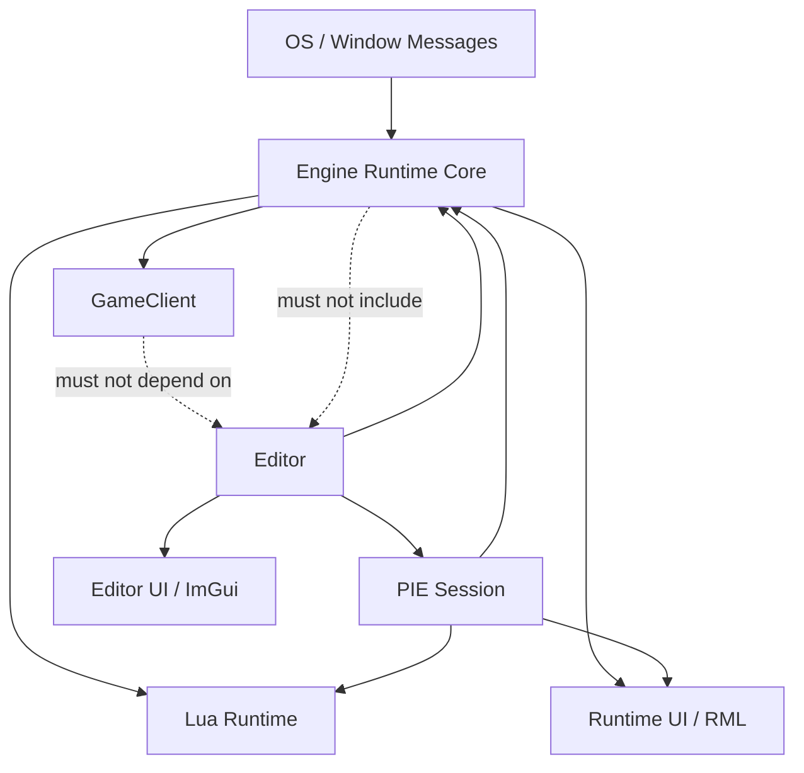
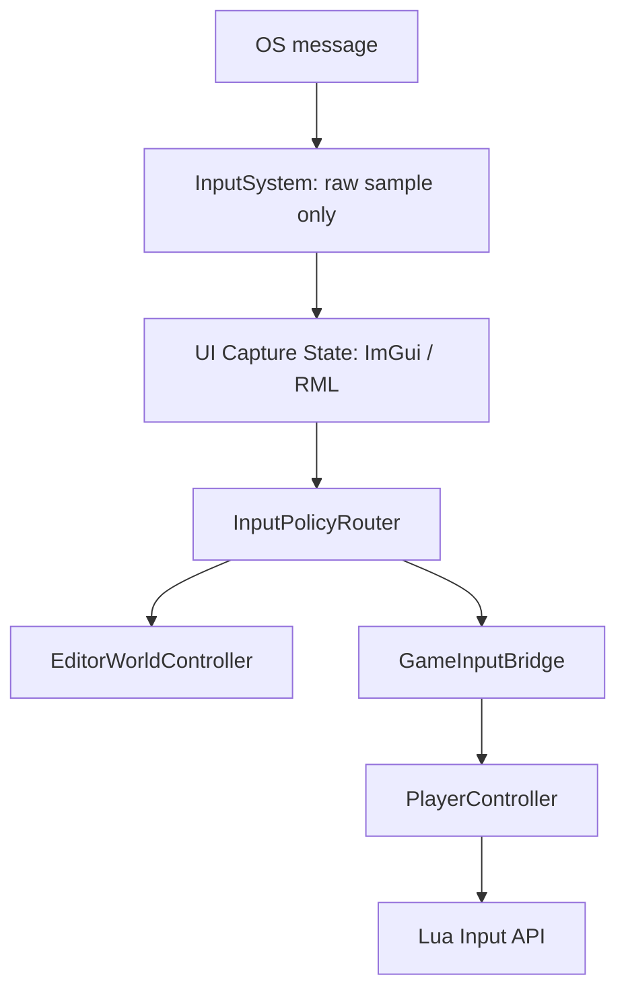
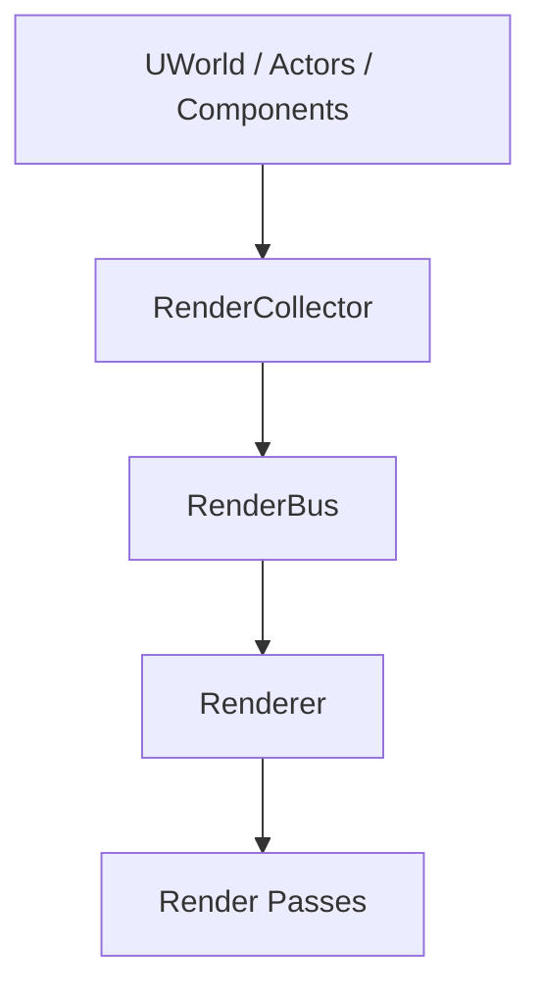
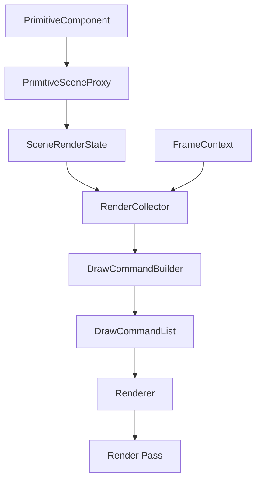
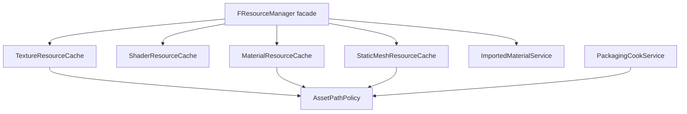
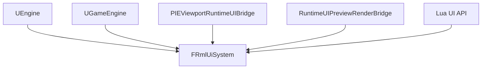
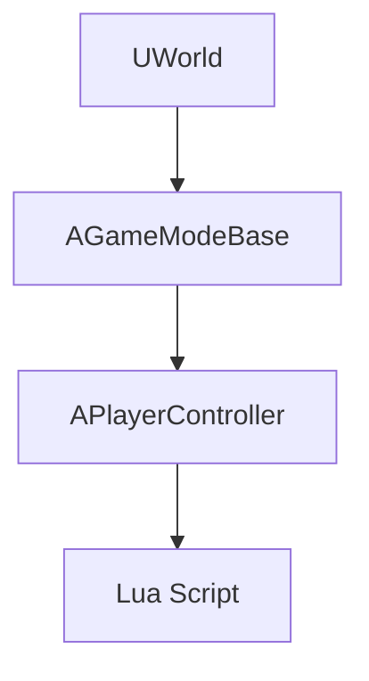

# Engine Structure Refactor Roadmap

Updated: 2026-05-06

이 문서는 NipsEngine을 장기적으로 더 읽기 쉽고, 의존성이 낮고, 학습량이 적고, 책임이 명확한 구조로 만들기 위한 최종 리팩토링 방안이다.

목표는 단순히 파일을 쪼개는 것이 아니다. Codex나 새 팀원이 코드를 봤을 때 다음 평가가 나오도록 만드는 것이다.

- Engine, Editor, PIE, GameClient의 책임 경계가 납득된다.
- 큰 기능의 진입점과 소유자가 명확하다.
- 기능 추가 시 어느 모듈을 수정해야 하는지 예측 가능하다.
- Runtime 코드가 Editor 정책에 끌려가지 않는다.
- PIE는 Editor 안에서 실행되는 Runtime 시뮬레이션이라는 정체성이 분명하다.
- 각 클래스가 한 가지 이유로 변경된다.
- 읽는 사람이 전체 엔진을 외우지 않아도 국소적으로 이해하고 수정할 수 있다.

## Evaluation Criteria

리팩토링의 성공 기준은 다음 다섯 가지다.

1. 가독성
   - 한 파일이 여러 화면을 넘겨도 역할이 한 가지면 허용할 수 있다.
   - 하지만 UI, 입력, 렌더, 저장, 패키징, Runtime UI 같은 서로 다른 정책이 한 파일에 섞이면 분리 대상이다.
   - 함수명과 클래스명만 보고 책임을 짐작할 수 있어야 한다.

2. 의존성
   - `Engine`은 `Editor`를 직접 include하지 않는다.
   - `GameClient`는 `Editor` 타입을 몰라야 한다.
   - `PIE`는 Editor 소유의 세션이지만 Runtime 규칙을 최대한 공유한다.
   - `Lua`, `RML`, `ImGui`는 입력을 직접 훔쳐보는 구조가 아니라 정책 계층을 통과해야 한다.

3. 학습량
   - 주요 기능은 2-3개의 파일을 보면 큰 흐름이 잡혀야 한다.
   - "이 클래스도 하고 저 클래스도 한다"가 아니라 "이 클래스는 조정자, 저 클래스는 실행자"가 되어야 한다.
   - 로컬 lambda와 익명 helper는 단기 구현에는 편하지만, 정책이 되는 순간 이름 있는 함수/클래스로 승격한다.

4. 구조
   - 시스템은 계층적으로 읽혀야 한다.
   - 상위 계층은 정책을 정하고, 하위 계층은 실행만 한다.
   - 렌더링, 입력, 에셋, UI, 저장은 각자 독립적인 흐름도를 가져야 한다.

5. 납득성
   - UE와 유사한 개념을 도입할 때는 왜 필요한지 설명 가능해야 한다.
   - 이름은 역할을 과장하지 않아야 한다.
   - 레거시 facade는 이행 기간에만 허용하고, 최종 구조에서는 제거한다.

## Current Diagnosis

우리 엔진은 기능 범위가 넓다.

- Editor
- PIE
- GameClient
- ObjViewer
- Runtime RML UI
- Lua scripting
- GameMode / PlayerController
- StaticMesh OBJ -> BIN -> Runtime loading
- Packaging
- ID Picking
- Outline
- Undo/Redo

이 자체는 강점이다. 다만 현재 구조는 여러 기능이 빠르게 추가되면서 일부 클래스가 과밀해졌다.

대표 위험 지점:

- `Editor/UI/EditorMainPanel.cpp`
  - editor layout, viewport drawing, PIE viewport, RML preview, packaging, scene close flow가 섞여 있다.
- `Engine/Core/ResourceManager.cpp`
  - texture, shader, material, static mesh, OBJ/MTL import, binary cache, editor LOD policy가 섞여 있다.
- `Editor/Viewport/EditorViewportClient.cpp`
  - camera navigation, picking, gizmo, selection, PIE possess/eject, cursor focus가 섞여 있다.
- `Engine/Render/Scene/RenderCollector.cpp`
  - world traversal, culling fallback, primitive draw command build, light collect, editor selection mask가 섞여 있다.
- `Engine/Runtime/EngineLoop.cpp`
  - launch mode selection과 editor/game/objviewer 생성 분기가 한 곳에 있다. 이 자체는 허용 가능하지만 include 경계는 더 깔끔해야 한다.

Week08 엔진에서 배울 점:

- Render Proxy, FrameContext, DrawCommandBuilder 구조는 학습량이 적고 역할이 선명하다.
- 큰 렌더링 흐름이 "Scene Proxy -> Collector -> DrawCommand -> Renderer"로 읽힌다.
- 파일 크기가 대체로 작고, 특정 기능의 소유자가 예측 가능하다.

우리 엔진이 유지해야 할 점:

- GameClient configuration이 실제로 존재한다.
- PIE와 Editor input 정책이 최근 분리 방향으로 가고 있다.
- Lua/RML/Packaging처럼 실제 게임 프로젝트에 가까운 복잡도를 이미 포함한다.
- Editor, PIE, Runtime을 분리하려는 요구가 명확하다.

결론:

- 현재 구조 점수는 Week08 쪽이 더 깔끔하다.
- 최종 구조 잠재력은 우리 엔진이 더 높다.
- 따라서 Week08의 "작고 납득되는 구조"를 흡수하되, 우리 엔진의 Runtime/PIE/GameClient 구분을 기준으로 재설계한다.

## Target Domain Boundaries

최종적으로 코드는 다음 도메인 경계를 지켜야 한다.



### Engine

Engine은 재사용 가능한 Runtime core다.

허용 책임:

- UObject / Actor / Component
- World / Level
- GameMode / PlayerController
- Input sampling primitives
- Renderer runtime core
- Asset loading and resource caches
- Lua runtime binding
- RML runtime UI system
- Runtime serialization
- Platform/window abstraction

금지 책임:

- ImGui editor UI
- Editor selection policy
- Editor viewport layout
- Editor settings direct read
- Editor-only picking UI behavior
- Packaging UI

### Editor

Editor는 도구 계층이다.

허용 책임:

- ImGui panels
- editor viewport layout
- editor selection and details
- editor-only input policy
- undo/redo
- content browser
- scene document state
- packaging orchestration
- PIE session ownership

금지 책임:

- Runtime renderer 내부 구현 변경
- GameClient-only boot behavior
- Runtime asset cache policy 직접 소유

### PIE

PIE는 Editor 안에서 Runtime world를 실행하는 세션이다.

허용 책임:

- active PIE world handle
- active viewport index
- possessed/editor-control state
- player controller pointer
- mouse focus release state
- shell commands: Esc, F8, Shift+F1
- runtime UI viewport mapping for PIE

금지 책임:

- editor panel drawing
- gameplay input interpretation
- RML document implementation

PIE의 핵심 정책:

- Possessed: Game input + Runtime UI input이 우선한다.
- Eject / EditorControl: Editor viewport setting을 따른다. Grid, Axis, Billboard, Gizmo, Selection은 강제로 숨기지 않는다.
- Runtime UI는 Eject 시 render/input capture를 하지 않는다.

### GameClient

GameClient는 standalone Runtime이다.

허용 책임:

- GameEngine boot
- GameMode selection
- PlayerController routing
- Runtime RML UI
- Lua gameplay script
- packaged asset loading

금지 책임:

- Editor include
- ImGui UI
- Editor settings
- Editor selection/picking tools

## Target Top-Level Layout

최종 구조의 방향은 다음과 같다.

```text
NipsEngine/Source
  Engine/
    Core/
    Object/
    Math/
    Platform/
    Runtime/
      Engine.h
      GameEngine.h
      EngineLoop.h
      LaunchModeFactory.h
    GameFramework/
      World.h
      Level.h
      AActor.h
      GameModeBase.h
      PlayerController.h
    Component/
    Input/
      InputSystem.h
      InputTypes.h
      InputPolicyTypes.h
    Render/
      Device/
      Resource/
      Scene/
        SceneRenderState.h
        PrimitiveSceneProxy.h
      Pipeline/
        FrameContext.h
        RenderCollector.h
        DrawCommandBuilder.h
        Renderer.h
      Pass/
    Asset/
      AssetPathPolicy.h
      TextureResourceCache.h
      ShaderResourceCache.h
      MaterialResourceCache.h
      StaticMeshResourceCache.h
      ImportedMaterialService.h
      ResourceManager.h
    UI/
      RmlUi/
    Runtime/Script/

  Editor/
    EditorEngine.h
    Input/
      EditorInputRouter.h
      EditorWorldController.h
      GameInputBridge.h
      EditorViewportNavigationController.h
      EditorTransformInteraction.h
      EditorPickingService.h
    PIE/
      PIESession.h
      PIEViewportRuntimeUIBridge.h
    Viewport/
      EditorViewportClient.h
      ViewportLayout.h
      SceneViewport.h
    Selection/
    Undo/
    Scene/
      EditorSceneDocument.h
      EditorSceneDocumentSerializer.h
    UI/
      MainPanel/
      ViewportPanel/
      RuntimeUIPreview/
      ContentBrowser/
      Details/
      Packaging/
    Packaging/

  Game/
    Project-specific C++ gameplay, if needed

  Misc/
    ObjViewer/
```

주의:

- 위 구조는 최종 방향이다. 한 번에 이동하지 않는다.
- 기존 파일을 무리하게 rename하면 충돌과 빌드 실패가 커진다.
- 각 batch는 기능 보존, 빌드 검증, GameClient 검증을 포함한다.

## Target Input Architecture

입력은 가장 먼저 정책이 명확해야 하는 영역이다.

최종 흐름:



역할:

- `InputSystem`
  - 키/마우스 raw state만 샘플링한다.
  - viewport ownership, picking 허용 여부, cursor lock 정책을 결정하지 않는다.

- `InputPolicyRouter`
  - ImGui/RML capture, viewport hover/focus/capture, relative mouse, absolute clip을 해석한다.
  - 한 프레임의 side-effect permission을 생성한다.
  - picking, gizmo hover, selection feedback 허용 여부를 명시한다.

- `EditorWorldController`
  - editor navigation, selection, transform shortcut, gizmo operation을 담당한다.
  - PIE shell key도 Editor 책임으로 처리한다.

- `GameInputBridge`
  - game input으로 넘길 수 있는 상태만 PlayerController에 전달한다.
  - PIE possessed와 GameClient에서 같은 의미를 가져야 한다.

- `PlayerController`
  - gameplay input을 해석한다.
  - Lua를 사용하는 프로젝트에서는 C++ controller가 얇아도 된다.

정책:

- LMB/RMB가 capture 중이면 passive picking, gizmo hover tint, selection hover feedback은 막는다.
- RML이 focused text input을 갖고 있으면 gameplay keyboard input은 막는다.
- PIE Eject에서는 Game input을 보내지 않고 Editor input을 보낸다.
- GameClient에는 Editor input layer가 존재하지 않는다.

## Target Rendering Architecture

렌더 구조는 Week08의 장점을 가장 많이 흡수할 대상이다.

현재 우리 구조:



문제:

- `RenderCollector`가 World traversal, culling, command build, editor selection mask를 동시에 처리한다.
- Renderer와 editor-only ID picking / selection / outline의 경계가 흐리다.
- Component 상태를 매 프레임 직접 해석하는 영역이 많다.

목표 구조:



역할:

- `PrimitiveSceneProxy`
  - 렌더러가 읽는 component snapshot이다.
  - transform/material/visibility/render bounds를 갖는다.
  - Component가 변경될 때 dirty flag로 갱신된다.

- `SceneRenderState`
  - World와 1:1로 대응하는 render-side scene이다.
  - proxy list, selected proxy, never-cull proxy, editor debug data를 가진다.

- `FrameContext`
  - camera, viewport rect, show flags, view mode, render target, light culling option 등을 한 프레임 단위로 제공한다.
  - `RenderBus`에 흩어진 per-frame state를 정리하는 방향이다.

- `RenderCollector`
  - scene/proxy를 필터링한다.
  - culling, visibility, pass eligibility만 판단한다.
  - material command 세부 구성은 하지 않는다.

- `DrawCommandBuilder`
  - proxy와 frame context를 draw command로 변환한다.
  - material/render state/shader selection을 여기로 모은다.

- `Renderer`
  - GPU resource binding과 pass execution에 집중한다.

Editor-only pass 정책:

- ID Picking, SelectionMask, Outline, Grid, Gizmo, DebugLine은 Editor pipeline 또는 Editor render extension에서 요청한다.
- GameClient renderer는 editor-only pass를 알 필요가 없도록 최종적으로 분리한다.
- 단, 이행 기간에는 기존 pass를 유지하되 entry point를 editor pipeline으로 한정한다.

## Target Asset Architecture

현재 `ResourceManager`는 너무 많은 책임을 갖는다.

목표:



역할:

- `AssetPathPolicy`
  - asset root, relative path normalization, UE-like naming policy를 담당한다.
  - `____` 같은 임시 sanitize 결과가 외부 파일명으로 새지 않게 한다.

- `TextureResourceCache`
  - texture load/cache/default fallback.

- `ShaderResourceCache`
  - shader source, CSO cache, compile/reload.

- `MaterialResourceCache`
  - `.mat` load/cache/save.

- `StaticMeshResourceCache`
  - OBJ -> BIN -> Runtime load policy.
  - BIN이 있으면 OBJ가 없어도 Runtime에서 동작해야 한다.

- `ImportedMaterialService`
  - OBJ/MTL import 결과를 engine material policy로 변환한다.
  - material naming과 texture reference rewrite를 책임진다.

- `FResourceManager`
  - 이행 중 facade로만 남긴다.
  - 최종적으로는 너무 많은 public API를 줄인다.

OBJ/BIN 정책:

- Editor import/build 단계:
  - OBJ/MTL/Texture를 읽고 `.bin`, `.mat`을 생성한다.
  - source asset이 바뀐 경우에만 rebuild한다.

- Runtime/GameClient:
  - `.bin`, `.mat`, texture만 필요하다.
  - OBJ/MTL source가 없어도 정상 동작해야 한다.

## Target Editor UI Architecture

현재 `EditorMainPanel`은 너무 많은 UI surface를 가진다.

현재 진단:

- `EditorMainPanel.cpp`는 4000줄 이상이며 Editor UI에서 가장 비대한 파일이다.
- `EditorMainPanel.h`도 이미 200줄 이상이고, widget 멤버뿐 아니라 packaging buffer, PIE fullscreen/layout snapshot, runtime UI callback queue, viewport icon SRV, footer/debug state를 직접 소유한다.
- 큰 함수들이 한 파일 안에 몰려 있다.
  - `RenderViewportIconToolbarForIndex`
  - `RenderBuildGameModal`
  - `RenderEditorToolbar`
  - `RenderViewportHostWindow`
  - `RenderFooterOverlay`
  - `RenderViewportContextMenu`
  - `RenderEditorDebugPanel`
  - `RenderUndoHistoryPanel`
- 파일 상단 anonymous namespace에도 packaging path, viewport label/icon, camera speed, drop path resolve, placement location, file dialog helper가 섞여 있다.

핵심 문제:

- MainPanel이 main dock host가 아니라 editor UI application object처럼 행동한다.
- draw code, state transition, async packaging, scene save/load, PIE layout, RML viewport mapping, content browser drop, icon resource lifetime이 한 클래스에 있다.
- 따라서 작은 UI 변경도 PIE, packaging, RML, scene dirty, viewport input에 side effect를 낼 수 있다.

최종 책임:

- `FEditorMainPanel`은 "Editor shell coordinator"로 축소한다.
- ImGui context 초기화, dockspace, top-level panel 호출 순서, close request orchestration만 가진다.
- 개별 surface의 세부 draw/state는 각 panel/service가 가진다.

목표:

```text
Editor/UI
  MainPanel/
    EditorMainPanel.h/.cpp
    EditorDockLayout.h/.cpp
    EditorWindowState.h/.cpp
  ViewportPanel/
    EditorViewportPanel.h/.cpp
    EditorViewportOverlayWidget.h/.cpp
    EditorToolbarWidget.h/.cpp
    EditorViewportToolbar.h/.cpp
    EditorViewportContextMenu.h/.cpp
    EditorViewportIconSet.h/.cpp
  RuntimeUIPreview/
    EditorRuntimeUIPreviewWidget.h/.cpp
    RuntimeUIPreviewRenderBridge.h/.cpp
  Details/
    EditorPropertyWidget.h/.cpp
    PropertyRowBuilder.h/.cpp
    ComponentDetailsPresenter.h/.cpp
  ContentBrowser/
    EditorContentBrowserWidget.h/.cpp
    AssetContextMenu.h/.cpp
  Packaging/
    EditorPackagingPanel.h/.cpp
    EditorPackagingSettingsPresenter.h/.cpp
```

정책:

- UI draw code와 mutation code를 분리한다.
- Undo snapshot은 UI 내부에서 직접 흩뿌리지 않고 `EditorUndoSystem`을 통해 수행한다.
- Details는 "현재 선택된 object"만 신뢰하고, Actor fallback은 명시적인 fallback일 때만 한다.
- Runtime UI Preview는 `FRmlUiSystem`을 직접 만지기보다 preview bridge를 통해 draw/input mapping을 맞춘다.

분리 순서:

1. Packaging 분리
   - `RequestBuildGame`, `TickBuildGameTask`, `RenderBuildGameModal`, packaging buffers, `OpenPackagingAssetFileDialog`, package path helpers를 `EditorPackagingPanel`로 이동한다.
   - `FEditorMainPanel`은 `PackagingPanel.Open()`과 `PackagingPanel.Render()`만 호출한다.

2. Viewport chrome 분리
   - `RenderViewportIconToolbarForIndex`, `RenderViewportMenuBarForIndex`, `DrawViewportIconButton`, `DrawViewportTextButton`, viewport icon SRV lifetime을 `EditorViewportToolbar`와 `EditorViewportIconSet`으로 이동한다.
   - Viewport toolbar는 `FEditorViewportClient`와 `FEditorSettings`만 받아서 그린다.

3. Viewport host 분리
   - `RenderViewportHostWindow`, PIE fixed aspect rect, `ApplyPIEFixedAspectViewportRect`, content browser drop 처리를 `EditorViewportPanel`로 이동한다.
   - MainPanel은 viewport panel의 render 결과와 focus request만 받는다.

4. Runtime UI bridge 분리
   - `RenderRuntimeUIForPIEViewport`, `QueueRuntimeUIDrawCallback`, `RenderRuntimeUIDrawCallback`을 `PIEViewportRuntimeUIBridge` 또는 `RuntimeUIPreviewRenderBridge`로 이동한다.
   - PIE possessed/eject 정책은 `FPIESession`과 bridge에서 결정한다.

5. Footer / debug / undo panels 분리
   - footer overlay는 `EditorFooterLogSystem` + `EditorFooterOverlay`로 이동한다.
   - debug panel은 별도 `EditorDebugPanel`로 이동한다.
   - undo history panel은 `EditorUndoHistoryPanel`로 이동한다.

6. Scene document flow 분리
   - `RequestNewScene`, `RequestLoadSceneWithDialog`, `RequestSaveScene`, `RequestSaveSceneAsWithDialog`, `CanCloseEditor`, `RestoreLastSceneFromProjectSettings`를 `EditorSceneDocument` / `EditorSceneDocumentController`로 이동한다.
   - MainPanel은 close request 시 document controller에 위임한다.

완료 조건:

- `EditorMainPanel.cpp`가 1000줄 이하로 내려간다.
- `EditorMainPanel.h`에는 top-level widget 멤버와 panel coordinator만 남는다.
- Packaging, Viewport toolbar, Runtime UI bridge, Scene document는 MainPanel 없이 단위 이해가 가능하다.
- PIE/GameClient/RML 변경 없이 UI shell만 분리되어야 한다.

## Target Scene / Dirty / Project Settings Architecture

목표:

```text
Editor/Scene
  EditorSceneDocument.h/.cpp
  EditorSceneDirtyTracker.h/.cpp
  EditorSceneDocumentSerializer.h/.cpp

Editor/Settings
  ProjectSettings.h/.cpp
  EditorSettings.h/.cpp
```

역할:

- `EditorSceneDocument`
  - current scene path
  - display name
  - dirty state
  - last saved revision/hash

- `EditorSceneDirtyTracker`
  - scene content mutation만 dirty로 본다.
  - viewport camera move, transient selection, preview UI state는 dirty가 아니다.

- `EditorSceneDocumentSerializer`
  - engine world snapshot + editor metadata를 저장한다.
  - runtime load는 editor metadata를 무시할 수 있어야 한다.

- `ProjectSettings`
  - last opened scene
  - packaging settings
  - build output name
  - missing path fallback policy

정책:

- Project.ini의 last scene path가 없거나 다른 컴퓨터에서 깨졌으면 New Scene으로 fallback한다.
- 저장 여부 질문은 dirty tracker가 true일 때만 뜬다.
- Ctrl+N과 Content Browser의 빈 Scene 생성은 같은 factory를 사용한다.

## Target RML Runtime UI Architecture

`FRmlUiSystem`은 Engine에 남기는 것이 맞다.

목표:



정책:

- Engine은 `FRmlUiSystem`과 getter만 가진다.
- GameClient는 full-screen runtime UI context를 사용한다.
- PIE possessed는 PIE viewport rect와 virtual layout mapping을 사용한다.
- PIE Eject는 RML render/input capture를 하지 않는다.
- Runtime UI Preview는 ImGui draw list 위에 올바른 rect로 렌더링한다.
- Lua UI API는 `GEngine->GetRmlUiSystem()`만 통해 접근한다.

## Target Game Framework Architecture

GameMode 도입 방향은 유지한다.



정책:

- `AGameModeBase`는 PlayerController class/instance policy를 가진다.
- GameClient boot와 PIE boot가 같은 GameMode 기반 생성 정책을 공유한다.
- Lua 중심 프로젝트라면 C++ PlayerController는 얇은 bridge가 된다.
- 사용하지 않는 sample controller는 제거한다.

## Dependency Rules

최종적으로 다음 규칙을 CI 또는 스크립트로 검사하는 것이 좋다.

1. `Source/Engine/**`에서 `#include "Editor/` 금지
2. `GameClient*` config에서 `Source/Editor/**` compile 금지
3. `Source/Editor/**`는 `Source/Engine/**` include 가능
4. `Source/Engine/Runtime/Script/**`는 Editor include 금지
5. `Source/Engine/UI/RmlUi/**`는 ImGui include 금지
6. `Source/Engine/Render/**`는 Editor settings 직접 include 금지
7. Editor-only render behavior는 Editor pipeline 또는 Editor render extension에서 시작해야 함

## Refactor Phases

각 phase는 독립 배치로 진행한다. 한 phase 안에서도 작은 batch로 쪼갠다.

### Phase 0: Guard Rails

목표:

- 구조 리팩토링 중 side effect를 줄이기 위한 기준선을 만든다.

작업:

- dependency scan script 추가
- `Engine -> Editor include` 목록 문서화
- Debug Editor build, GameClientDebug build를 기본 검증으로 고정
- 주요 모드 수동 체크리스트 작성

완료 조건:

- 현재 위반 목록을 알고 있다.
- 새 위반이 생기면 바로 발견 가능하다.

### Phase 1: EditorEngine / EditorMainPanel Diet

목표:

- Editor top-level class의 책임을 줄인다.

작업:

- RML 관련 코드는 `FRmlUiSystem` + bridge로 유지
- Undo/Redo는 `EditorUndoSystem`으로 고정
- `EditorMainPanel`에서 Packaging panel 분리
- Runtime UI Preview bridge 분리
- scene close/save prompt flow를 `EditorSceneDocument`로 이동

완료 조건:

- `EditorEngine`은 coordinator 역할만 한다.
- `EditorMainPanel`은 main dock/layout 책임만 가진다.

### Phase 2: Input Finalization

목표:

- Input ownership이 한눈에 읽히게 한다.

작업:

- `InputPolicyRouter`를 authoritative policy owner로 고정
- `EditorViewportClient`에서 picking, gizmo, camera navigation을 분리
- `EditorPickingService`
- `EditorTransformInteraction`
- `EditorViewportNavigationController`
- PIE shell command는 `FPIESession`과 Editor controller 경유로 정리
- Lua input은 PlayerController/GameInputBridge 이후로만 의미를 갖게 정리

완료 조건:

- Space/QWER/1234 transform mode
- LMB/RMB capture
- PIE Esc/F8/Shift+F1
- RML text input capture
- GameClient input

위 항목이 서로 깨지지 않는다.

### Phase 3: Render Proxy Architecture

목표:

- Week08의 장점인 Proxy/Frame/Builder 구조를 우리 엔진에 맞게 흡수한다.

작업:

- `PrimitiveSceneProxy` 도입
- `SceneRenderState` 도입
- Component dirty -> proxy update 경로 추가
- `FrameContext` 도입
- `RenderCollector`는 filtering/culling 위주로 축소
- `DrawCommandBuilder` 도입
- Editor-only commands를 Editor pipeline entry로 이동

완료 조건:

- Renderer가 Component를 직접 해석하는 일이 줄어든다.
- Editor ID Picking/Outline/Grid/Gizmo가 GameClient 렌더 경로에서 분리된다.

### Phase 4: Asset and Resource Split

목표:

- ResourceManager를 책임별 cache/service로 분리한다.

작업:

- `AssetPathPolicy`
- `TextureResourceCache`
- `ShaderResourceCache`
- `MaterialResourceCache`
- `StaticMeshResourceCache`
- `ImportedMaterialService`
- OBJ/MTL/BIN 정책 정리
- CSO cache 정책 정리
- Packaging cook/copy policy 정리

완료 조건:

- OBJ가 없어도 BIN + MAT + Texture로 Runtime/GameClient가 동작한다.
- material naming이 UE-like policy를 따른다.
- ResourceManager는 facade 이상으로 비대해지지 않는다.

### Phase 5: Scene Document and Serialization Split

목표:

- Runtime serialization과 Editor document persistence를 분리한다.

작업:

- `WorldSnapshotSerializer`
- `EditorSceneDocumentSerializer`
- `EditorSceneDirtyTracker`
- Project.ini last scene fallback
- New Scene factory 통합

완료 조건:

- 빈 scene을 만들고 저장/닫기/다시 열기 정책이 납득된다.
- 수정하지 않은 scene에서 저장 질문이 뜨지 않는다.
- 다른 컴퓨터에서 last scene path가 깨져도 New Scene으로 안정 fallback한다.

### Phase 6: Build and ThirdParty Polish

목표:

- 빌드 시간이 짧고 설정이 예측 가능해야 한다.

작업:

- RmlUi/SoLoud static lib stamp/hash policy 유지
- Release Editor/GameClient lib copy 검증
- CSO cache packaging 포함
- cooked mesh/bin copy policy 정리
- third-party build scripts 문서화

완료 조건:

- third-party source가 있어도 일반 빌드에서 매번 lib rebuild가 돌지 않는다.
- Release Editor와 GameClient에서 필요한 runtime 산출물이 누락되지 않는다.

## Refactor Batch Rules

각 batch는 다음 규칙을 따른다.

- 기능 보존을 최우선으로 한다.
- 한 batch에서 public API 변경과 대규모 파일 이동을 동시에 하지 않는다.
- rename은 마지막에 한다.
- facade를 만들 경우 제거 계획도 같은 문서에 적는다.
- `Engine`, `Editor`, `PIE`, `GameClient` 영향 범위를 매번 명시한다.
- 애매한 정책은 구현 전에 동의를 구한다.
- namespace와 local lambda 증가는 지양한다.
- 레거시 경로는 오래 남기지 않는다.

검증 기본값:

- Editor Debug build
- GameClientDebug build
- whitespace check
- 수동 체크:
  - Editor viewport selection
  - Details component selection
  - transform gizmo shortcuts
  - PIE possess/eject
  - RML UI render/input
  - Runtime UI Preview
  - GameClient launch

## Priority Recommendation

최우선 순위는 다음이다.

1. Input finalization
   - 현재 버그 히스토리상 가장 많은 side effect가 입력 ownership에서 발생했다.

2. EditorMainPanel / EditorViewportClient diet
   - 큰 파일을 줄이면 이후 버그 수정 비용이 크게 줄어든다.

3. Render Proxy architecture
   - ID Picking, Outline, Billboard alpha, Editor-only visibility 정책이 장기적으로 안정된다.

4. ResourceManager split
   - OBJ/BIN/Material/Texture/CSO/Packaging 정책이 한 파일에서 충돌하지 않게 된다.

5. Scene document split
   - dirty 판단, last scene, empty scene 생성 정책이 납득 가능해진다.

## Final Target Impression

최종적으로 코드를 처음 보는 사람이 다음처럼 이해할 수 있어야 한다.

- Engine은 Runtime core다.
- Editor는 Engine 위에 얹힌 tool layer다.
- PIE는 Editor가 소유하는 Runtime session이다.
- GameClient는 Editor 없이 Engine만으로 돈다.
- Input은 하나의 policy router가 소유권을 정한다.
- Rendering은 Component snapshot인 Proxy를 통해 이루어진다.
- ResourceManager는 cache/service facade일 뿐 모든 asset 정책을 혼자 갖지 않는다.
- UI panel은 draw만 하고, mutation은 system/service가 담당한다.

이 상태가 되면 "기능은 많은데 어디서 뭘 하는지 모르겠다"가 아니라, "기능이 많지만 각 기능의 집이 있다"는 평가를 받을 수 있다.
