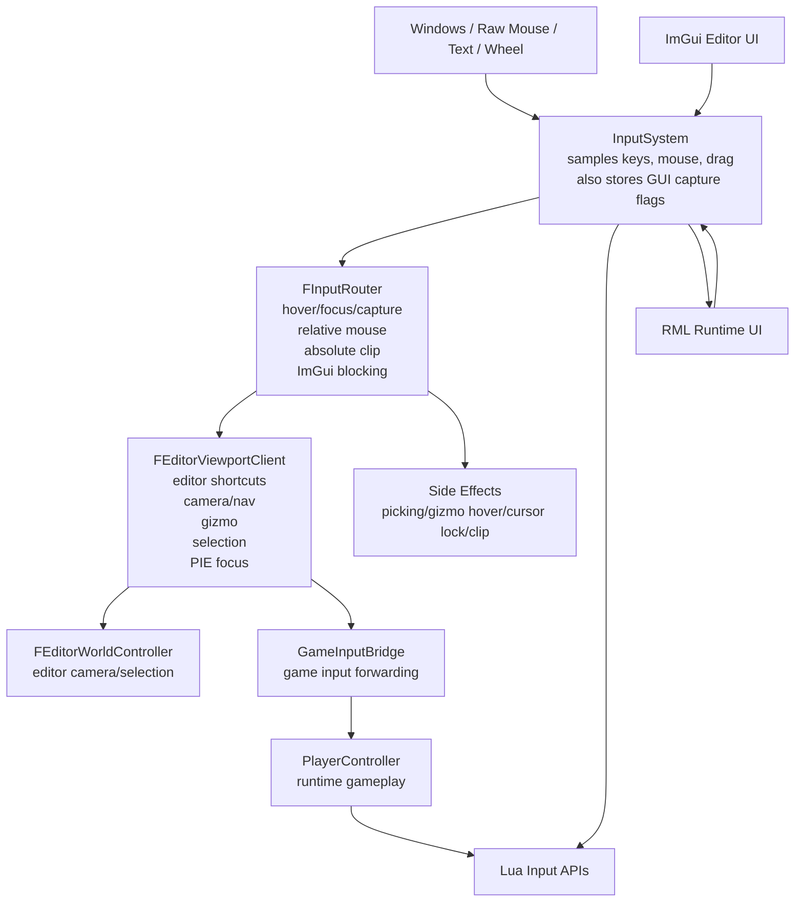
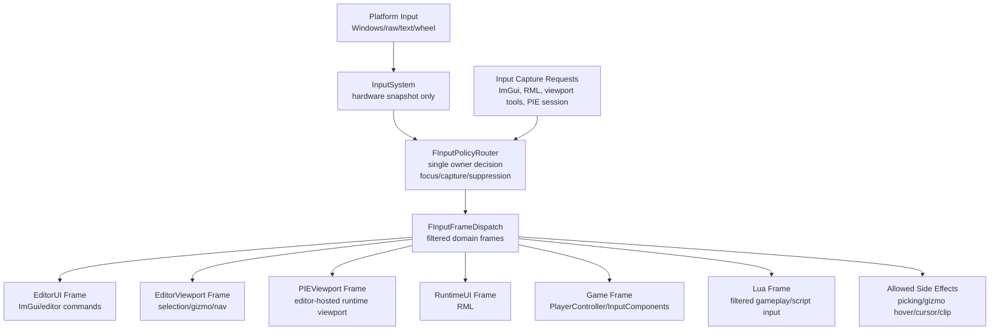
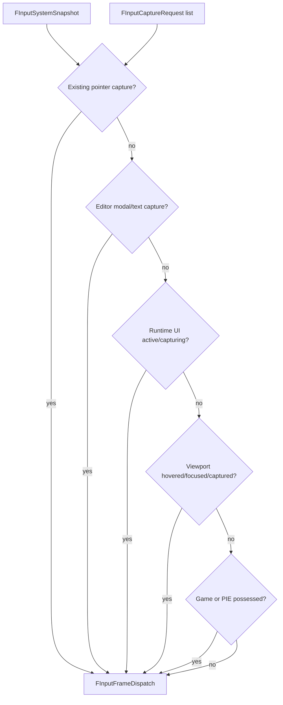
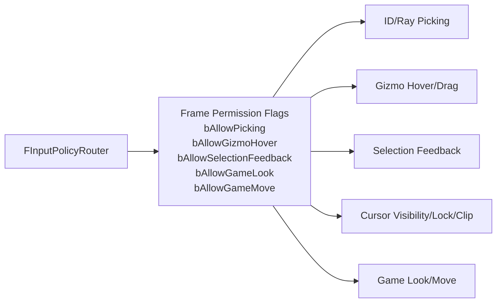
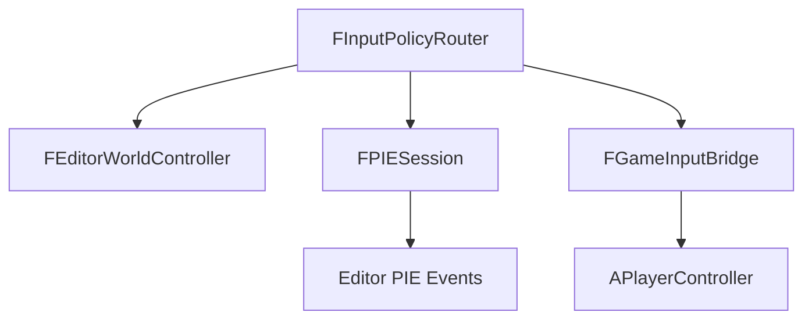
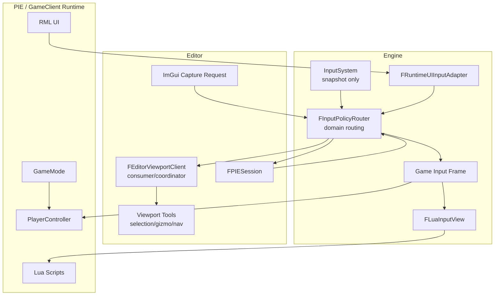

# Input Refactor Batch Plan

Updated: 2026-05-06

Progress: Input refactor batches completed and cleaned up (100%).

Purpose: define the refactor path before code changes. This plan keeps the current structure recognizable, but moves input ownership decisions into one explicit policy layer.

Further input policy changes should be treated as new work and approved separately.

## Goals

- Keep `InputSystem` as hardware sampler only.
- Make one policy layer decide input ownership per frame.
- Deliver filtered input to Editor, PIE, Runtime UI, Game, and Lua.
- Prevent side effects such as picking, gizmo hover tint, selection feedback, and cursor lock from running under the wrong owner.
- Avoid broad namespace/helper growth. Prefer named classes or small private member functions.
- Preserve current behavior batch by batch unless a behavior change is explicitly approved.

## Current Structure

Current issue:

- Ownership is spread across `InputSystem`, `FInputRouter`, `FEditorViewportClient`, RML pumping, Game input, and Lua APIs.
- UI capture can block some input while passive viewport side effects still run.
- PIE and GameClient can diverge because PIE goes through editor viewport state first.
- Lua can observe input at a different layer than gameplay if raw APIs are used.

## Target Structure

Target rule:

- `InputSystem` only reports what happened.
- `FInputPolicyRouter` decides who owns it.
- Lower domains receive zeroed/filtered input when blocked.
- Lua receives the same filtered gameplay input as Game unless an explicit raw debug API is used.

## Ownership Decision Model

Priority:

1. Existing pointer capture until release/cancel.
2. Editor modal or text input.
3. Runtime UI capture/focus.
4. Hovered/focused/captured viewport.
5. Possessed PIE or GameClient gameplay.
6. No owner.

## Side Effect Gates

Side effects must be based on policy output, not ad hoc checks.

Required flags:

- `bAllowPicking`
- `bAllowGizmoHover`
- `bAllowSelectionFeedback`
- `bAllowEditorShortcuts`
- `bAllowGameActions`
- `bAllowGameLook`
- `bAllowGameMove`
- `bAllowTextInput`

Rules:

- LMB/RMB drag/capture blocks passive picking.
- LMB/RMB drag/capture blocks passive gizmo hover tint unless the gizmo is already held.
- UI text capture blocks editor/game shortcuts except explicit command whitelist.
- Runtime UI form control blocks Game and Lua gameplay input.
- Relative mouse output is visible only to the owning domain.
- Absolute clip is visible only to the owning domain.

## Naming and Namespace Policy

Avoid broad namespaces and anonymous helper sprawl during this refactor.

Allowed:

- Small private member functions on the class that owns the behavior.
- Small file-local `static` functions only when they are pure and do not encode policy.
- Named structs/classes for policy data.

Avoid:

- New `namespace { ... }` blocks for policy-heavy logic.
- Large local lambdas for routing or capture decisions.
- Helper functions that read global state directly.
- Keeping legacy duplicated routes after the batch is complete.

Preferred names:

- `FInputPolicyRouter`
- `FInputCaptureRequest`
- `FInputFrameDispatch`
- `FInputDomainFrame`
- `FInputSideEffectPermissions`
- `FGameInputBridge`
- `FRuntimeUIInputAdapter`
- `FLuaInputView`

## Game Input Bridge Naming Decision

`FGameInputBridge` is mostly a game input bridge. It forwards PIE viewport input to the runtime `APlayerController`, but still contains a few editor/PIE shell responsibilities that will move to `FPIESession`.

UE-style naming split:

- Runtime gameplay controller: `APlayerController` by default; project subclasses are optional when C++ gameplay input is intentionally introduced.
- Editor/PIE bridge for filtered gameplay input: `FGameInputBridge`.
- Later PIE session owner: `FPIESession`.

Do not introduce a separate UObject-style `GameInputController` for the bridge. In UE terms, gameplay controller identity belongs to `PlayerController`, which is object/actor-lifetime driven. The bridge should remain a plain `F` class because it only routes filtered input and owns no reflected gameplay object lifetime.

Applied pre-batch rename:

- `GameController.h/.cpp` -> `GameInputBridge.h/.cpp`
- `FGameController` -> `FGameInputBridge`
- `EActiveEditorController::PIEController` -> `EActiveEditorController::GameInputBridge`
- `GetPIEController()` -> `GetGameInputBridge()`
- member `PIEController` -> `GameInputBridge`

This rename should be included in Batch 1 or an isolated pre-batch because it is mostly mechanical and lowers confusion before policy work starts.

## GameMode Ownership Decision

`AGameModeBase` owns the runtime gameplay bootstrap rule for choosing and spawning `APlayerController`.

UE-style split:

- `AGameModeBase`: runtime world rule object. It chooses the PlayerController class and guarantees the controller exists.
- `APlayerController`: runtime player input, possession, view target, and camera ownership.
- `FPIESession`: editor-only session state and non-owning PIE references.
- `FGameInputBridge`: editor-hosted forwarding bridge for filtered gameplay input.

Applied in Batch 6C:

- Added minimal `AGameModeBase` as an `AActor` so it follows the current object/factory/world lifetime model.
- GameClient now asks `GameMode` to spawn the configured `PlayerControllerClass`.
- PIE now creates a PIE-local `GameMode` and asks it to spawn `APlayerController`.
- `FPIESession` still stores the active PIE `APlayerController` as a non-owning session reference; the runtime world owns actor lifetime.

This avoids a free-floating bootstrap helper and makes the reason for PlayerController creation visible in the world/gameplay layer.

## PIE Shell Command Policy

PIE-only editor commands should be owned by the editor-side controller/session boundary, not by runtime `APlayerController`.

Examples:

- `Esc`: request end PIE.
- `F8`: toggle possess/eject if supported.
- `Shift + F1`: release mouse capture and show cursor.

Target split:

- `FEditorWorldController`: editor viewport navigation, editor selection, gizmo/tool input.
- `FPIESession`: PIE state, possess/eject, mouse capture, editor escape commands, start/stop notifications.
- `FGameInputBridge`: temporary bridge that receives the filtered game input frame and forwards game-allowed input to `APlayerController`.
- `APlayerController`: runtime gameplay input only.

Long-term target:

- Remove editor/PIE shell behavior from `FGameInputBridge`.
- Let `FPIESession` consume PIE shell commands first.
- Broadcast PIE session events to editor systems when the editor shell handles a command.
- Forward only gameplay-allowed input to `APlayerController`.

This keeps GameClient behavior clean because GameClient never depends on editor-only PIE shell commands.

## Domain Usage Model

Mode rules:

- Editor only: `FEditorWorldController` receives editor input. `FGameInputBridge` is inactive.
- PIE possessed: `FPIESession` receives PIE shell commands first. `FGameInputBridge` receives remaining gameplay-allowed input and forwards it to `APlayerController`.
- PIE ejected/editor-control mode: `FPIESession` still receives PIE shell commands. `FEditorWorldController` receives viewport navigation/tool input. `FGameInputBridge` is inactive unless explicitly possessed.
- GameClient: no editor controller and no PIE session. Runtime input goes directly through the runtime game input path into `APlayerController` and Lua.

## Batch 0: Documentation Only

Status: completed.

Work:

- Keep code unchanged.
- Review current and target diagrams.
- Confirm batch ordering.

Validation:

- None.

Exit criteria:

- User approves Batch 1 scope.

## Batch 1: Introduce Types Without Behavior Change

Goal:

- Add explicit policy vocabulary while keeping existing behavior intact.

Status: completed on 2026-05-06.

Changes:

- Add `EInputDomain`.
- Add `FInputCaptureRequest`.
- Add `FInputSideEffectPermissions`.
- Add `FInputFrameDispatch`.
- Add comments around existing `InputSystem` GUI flags marking them as compatibility capture declarations.

Expected touched files:

- `Engine/Input/InputTypes.h` or a new nearby header.
- `Engine/Input/InputRouter.h/.cpp`.
- Minimal includes only.

Side effect prevention:

- No routing behavior changes.
- No changes to cursor lock/clip.
- No changes to Lua or RML.

Validation:

- Editor Debug build.
- GameClient Debug build.
- Editor launch smoke.

Rollback:

- Remove new types if unused.

## Batch 2: Policy Router Wrapper Around Existing Router

Goal:

- Create the central policy object but delegate to current `FInputRouter` behavior.

Status: completed on 2026-05-06.

Changes:

- Add `FInputPolicyRouter` wrapper.
- Current `FInputRouter::Tick` output becomes part of `FInputFrameDispatch`.
- Existing ImGui blocking logic remains, but produces permission flags.
- Add `bAllowPicking`, `bAllowGizmoHover`, `bAllowSelectionFeedback` derived from current context.

Expected touched files:

- `InputRouter.h/.cpp`.
- `EditorViewportClient.cpp` only where it reads permission flags.

Side effect prevention:

- Permission flags initially mirror current behavior.
- Keep old checks until new flags are verified.

Validation:

- Transform shortcuts: `QWER`, `1234`, `Space`.
- Editor actor selection.
- Gizmo hover and drag.
- Camera RMB navigation.
- ImGui text field does not select actor.

Rollback:

- Stop reading permission flags and return to old checks.

## Batch 3: Move Passive Side Effects Behind Policy Flags

Goal:

- Ensure picking/gizmo hover/selection feedback do not run during blocked capture.

Status: completed on 2026-05-06.

Changes:

- `EditorViewportClient` checks `FInputSideEffectPermissions`.
- ID Picking and Ray Picking only run when `bAllowPicking`.
- Passive gizmo hover only updates when `bAllowGizmoHover`.
- Box select, gizmo drag, camera look explicitly set capture/permission intent.

Expected touched files:

- `EditorViewportClient.cpp/.h`.
- Possibly editor viewport tool classes.

Side effect prevention:

- No GameClient input behavior changes.
- No RML changes.
- Keep transform shortcut path unchanged.

Validation:

- LMB box select blocks hover tint and picking.
- RMB camera look blocks hover tint and picking.
- Gizmo drag keeps held axis feedback but blocks unrelated hover changes.
- Clicking empty viewport clears selection only when picking is allowed.

Rollback:

- Restore old passive hover/picking checks.

## Batch 4: Runtime UI and Game Filter Alignment

Goal:

- PIE and GameClient use the same RuntimeUI/Game filtered input rules.

Status: completed on 2026-05-06.

Changes:

- Add `FRuntimeInputPermissions` as the shared runtime input policy result.
- GameClient `PlayerController` routing uses runtime policy permissions after RML input is pumped.
- PIE RML input and GameClient RML input use the same `bAllowRuntimeUIInput` rule.
- Lua gameplay input exposure uses the same runtime policy permissions instead of duplicating mode checks.
- Keep `FRuntimeUIInputAdapter` deferred until Runtime UI needs a larger frame adapter.
- Keep existing direct `PlayerController` input pump shape to minimize side effects.
- Existing `ERuntimeInputMode` becomes policy input:
  - `GameOnly`
  - `UIOnly`
  - `GameAndUI`

Expected touched files:

- `GameEngine.cpp/.h`.
- `EditorEngine.cpp/.h`.
- RML runtime module/input pump code.
- Possibly `PlayerController`.

Side effect prevention:

- PIE shell still controls whether runtime viewport can receive input.
- Runtime UI does not directly read raw `InputSystem` for gameplay-blocking decisions.

Validation:

- GameClient UI text input.
- PIE RML form input.
- UIOnly blocks movement/look.
- GameOnly keeps gameplay input.
- GameAndUI allows non-consumed gameplay input.

Rollback:

- Switch RML/Game input pump back to existing direct path.

## Batch 5: PIE Session Boundary

Goal:

- Make PIE input ownership explicit.

Status: completed. Batch 5A, 5B, 5C, 5D, and 5E completed on 2026-05-06.

Changes:

- Add `FPIESession` or equivalent.
- Move active PIE viewport index, player controller, possess/editor-control mode, mouse focus release/reacquire into it.
- `EditorViewportClient` asks PIE session for input mode instead of owning all PIE state itself.

Batch 5A completed:

- Added `FPIESession` as an editor-only session state holder.
- Moved active PIE viewport index ownership into `FPIESession`.
- Moved PIE viewport-to-world handle ownership into `FPIESession`.
- Moved pending PIE viewport focus frame ownership into `FPIESession`.
- Kept existing start/stop/pause/resume behavior and viewport possess/eject behavior unchanged.
- Kept GameClient free of editor-only PIE session compilation.

Batch 5B completed:

- Added `EPIESessionShellCommand` for PIE shell commands.
- Added `IPIESessionShellCommandHandler` so the session can dispatch shell commands without owning viewport internals.
- Routed PIE `Esc`, `F8`, and `Shift + F1` command execution through `FPIESession`.
- Kept input detection in `FEditorViewportClient` to preserve shortcut timing and routed/legacy input behavior.
- Kept existing `StopPlaySession`, possess/eject, and mouse focus release implementations unchanged.

Batch 5C completed:

- Added `EPIESessionControlMode` to make PIE inactive/possessed/editor-control state explicit.
- Moved PIE possess/editor-control status ownership into `FPIESession`.
- Kept actual input routing in the existing router/controller path so behavior stays unchanged.
- Updated `FEditorViewportClient` query helpers to ask `FPIESession` for PIE control mode.
- Verified Debug Editor and GameClientDebug builds still compile without editor-only leakage into GameClient.

Batch 5D completed:

- Moved PIE mouse-focus released state ownership into `FPIESession`.
- Removed `FEditorViewportClient`'s direct `bPIEMouseFocusReleased` state.
- Kept cursor visibility, mouse lock, and reacquire behavior in `FEditorViewportClient` for now.
- Preserved Shift+F1 release and viewport-click reacquire timing.
- Verified Debug Editor and GameClientDebug builds.

Batch 5E completed:

- Moved PIE `APlayerController` session bookkeeping into `FPIESession`.
- Kept `FGameInputBridge` as the gameplay input forwarding target holder.
- Synchronized `FPIESession` and `FGameInputBridge` when PIE sets or clears the player controller.
- Updated PIE possessed camera restore path to read the session's player controller.
- Verified Debug Editor and GameClientDebug builds.

Expected touched files:

- `EditorEngine.cpp/.h`.
- `EditorViewportClient.cpp/.h`.
- `EditorMainPanel.cpp`.
- New PIE session files.

Side effect prevention:

- Keep current UI layout and drawing order.
- Keep existing start/stop PIE behavior.
- Do not alter scene cloning/loading in same batch.

Validation:

- PIE start/stop.
- F8 possess/eject.
- Mouse focus release/reacquire.
- Runtime UI under editor UI draw order.
- PlayerController still receives input.

Rollback:

- Retain old `EditorViewportClient` state until session path is verified, then remove old fields.

## Batch 6: Lua Input View

Goal:

- Lua gameplay sees the same filtered input as gameplay.

Status: completed. Batch 6A, 6B, and 6C completed on 2026-05-06.

Changes:

- Add `FLuaInputView` or equivalent.
- `LuaInput.GetAction` / `GetAxis` read filtered game frame.
- Existing raw key APIs become explicitly named or guarded.
- Text input is delivered only according to policy.

Batch 6A completed:

- Added `FLuaInputView` inside the Lua input binding implementation.
- Moved Lua gameplay key, mouse button, mouse delta, scroll, and any-mouse queries behind the view.
- Kept existing Lua API names unchanged.
- Preserved existing UI raw input APIs such as `IsUIKeyDown`.
- Preserved text consumption behavior for this low-risk structure pass.
- Verified Debug Editor and GameClientDebug builds.

Batch 6B completed:

- Routed Lua `ConsumeTextInput` through `FLuaInputView`.
- Lua text input now returns an empty string when runtime policy blocks Lua keyboard input.
- Avoided consuming the script text queue when Lua text input is blocked, while RML's separate text queue remains unchanged.

Batch 6C completed:

- Added minimal `AGameModeBase` runtime bootstrap ownership.
- Moved PIE and GameClient `APlayerController` creation behind `AGameModeBase::EnsurePlayerController`.
- Kept `FGameInputBridge` and `FPIESession` as non-owning routing/session references to preserve existing input behavior.
- Verified Debug Editor and GameClientDebug builds.

Expected touched files:

- `LuaInputAPI.cpp`.
- `ScriptManager` input bindings.
- Possibly script docs/examples.

Side effect prevention:

- Keep old Lua APIs temporarily as wrappers if needed, but clearly mark them.
- Do not change gameplay scripts and API names in the same batch unless approved.

Validation:

- Existing Lua gameplay input.
- RML form control blocks Lua gameplay input.
- Text input consumed once.
- GameClient Release behavior confirmed.

Rollback:

- Repoint Lua APIs to previous input source.

## Batch 7: Remove Legacy Duplicate Paths

Goal:

- Remove compatibility routes after all domains use policy output.

Status: completed. Batch 7A, 7B, and 7C completed on 2026-05-06.

Changes:

- Remove stale GUI capture ownership from `InputSystem`.
- Remove duplicate raw input checks from `EditorViewportClient`.
- Remove direct runtime UI/game raw input reads.
- Remove compatibility wrappers if no longer needed.

Batch 7A completed:

- Removed PIE end-play callback ownership from `FGameInputBridge`.
- Removed `Esc` from `FGameInputBridge` watched-key forwarding so PIE shell input does not leak into `APlayerController`.
- Kept PIE `Esc`, `F8`, and `Shift + F1` on the `FPIESession` shell command path.
- Verified LMB/RMB capture side-effect gates already suppress passive picking, gizmo hover tint, and selection feedback in routed and legacy viewport paths.
- Verified Debug Editor and GameClientDebug builds.

Batch 7B completed:

- Audited `AGameJamPlayerController` and confirmed it only remained through old defaults and project registration.
- Removed `AGameJamPlayerController` because gameplay input now belongs to Lua through `Engine.API.Input`.
- Switched engine, PIE, and GameMode defaults to `APlayerController`.
- Kept `APlayerController` as the bootstrap-only controller for possession, view target, runtime camera, and Lua-facing input delivery.

Batch 7C completed:

- Removed the legacy `FEditorViewportClient` raw keyboard and mouse polling fallback.
- Kept editor shortcuts, PIE shell commands, navigation, gizmo, and selection input on the routed `FViewportInputContext` path.
- Removed the editor-side legacy suppression flag because `FInputPolicyRouter` now owns the first input pass for editor viewports.
- Removed the unused raw `InputSystem` passive feedback suppression helper from `FEditorViewportClient`.

Expected touched files:

- Many small cleanup edits.

Side effect prevention:

- Only after Batches 1-6 are verified.
- No new behavior.

Validation:

- Full Editor Debug build.
- Full GameClient Debug build.
- PIE smoke.
- GameClient smoke.
- Lua smoke.
- Editor selection/gizmo smoke.

Rollback:

- Do not start this batch until previous behavior is stable.

## Final Structure

## Final Validation Checklist

- Editor Debug build.
- GameClient Debug build.
- Editor transform shortcuts: `QWER`, `1234`, `Space`.
- Editor selection, gizmo hover, gizmo drag, and box selection.
- PIE shell commands: `Esc`, `F8`, `Shift + F1`.
- PIE and GameClient Lua input through `Engine.API.Input`.
- RML text input blocks gameplay/Lua input according to runtime policy.

Any broader input architecture work after this point should start as a new approved batch.
