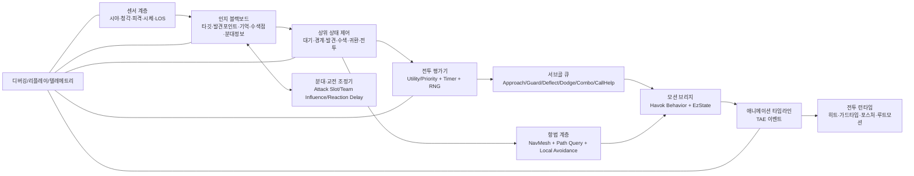
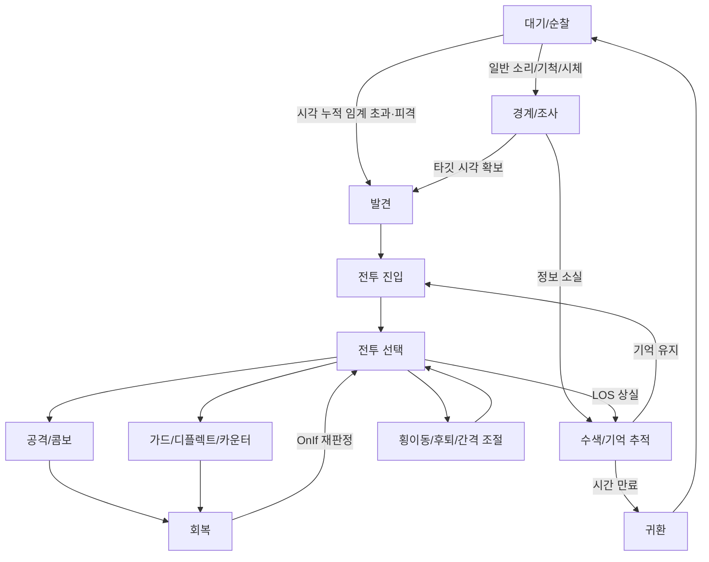
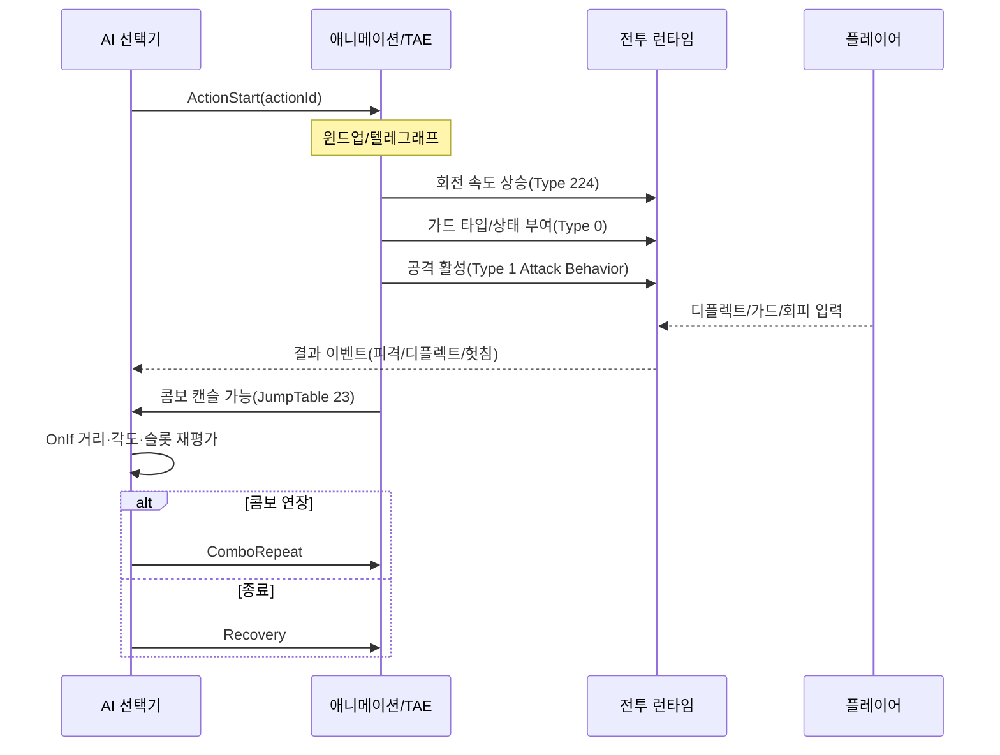

# 세키로 적 AI 시스템 역설계와 엔진 구현 보고서

## 요약문

이 보고서의 핵심 결론은 분명합니다. **세키로식 적 AI의 본질은 “높은 지능” 자체가 아니라, “감지-기억-전투-애니메이션-군중 제어”가 매우 짧은 시간축에서 정교하게 맞물리는 구조**에 있습니다. 공식 인터뷰에서 미야자키는 세키로 전투의 핵심으로 “검이 맞부딪히는 폭력성”과 수직 이동성을 강조했고, 스텔스는 전투를 대체하는 축이 아니라 **교전 개시를 유리하게 만드는 도구**로 설명했습니다. 또한 공식 사전 인터뷰와 Xbox 인터뷰는 포스처가 지속 압박을 요구하며, 적의 체력을 깎아 포스처 회복을 늦추는 식으로 **근거리 주도권 싸움**을 유도한다고 밝힙니다. 즉, 세키로의 AI는 “플레이어를 쫓아가서 때리는 AI”가 아니라, **가드/디플렉트/카운터/짧은 재배치/콤보 취소를 애니메이션 이벤트에 맞춰 반복하는 교전 오케스트레이터**에 가깝습니다. citeturn9view2turn9view0turn9view4turn9view5turn8search8

기술 계보도 비교적 선명합니다. FromSoftware 채용 인터뷰에 따르면, Bloodborne 개발 시 복잡한 모션 블렌딩을 위해 캐릭터 제어와 툴을 **Havok Behavior 기반으로 재구성**했고, 그 결과물이 Sekiro에도 이어졌습니다. 같은 인터뷰는 캐릭터 모션 전이가 **게임 플래너가 작성한 스크립트**로 제어되고, 프로그래머는 그 스크립트가 입력 판정, 대미지 결과, 특정 모션 타이밍 콜백을 사용할 수 있게 만든다고 설명합니다. Souls Modding Wiki와 Paramdex의 공개 자료는 이 구조를 구체화합니다. Sekiro에는 `NpcThinkParam`, `NpcParam`, `NpcAiActionParam`, `BehaviorParam`, `TAE`, 그리고 Battle Goal/Lua 계층이 존재하며, 저수준 애니메이션 시퀀싱과 상위 AI 논리가 분리되어 있습니다. 따라서 **여러분 엔진에서 가장 먼저 만들어야 할 것은 “거대한 단일 FSM”이 아니라, 감지 블랙보드 + 상위 상태머신 + 액션 평가기 + 애니메이션 타임라인 브리지의 계층 구조**입니다. citeturn6search0turn14view2turn19search0turn20view0turn21view0turn21view1turn21view2turn37view0turn38view0

Sekiro의 공개 param 정의는 이 보고서에서 가장 중요한 단서입니다. `NpcThinkParam`에는 **시야 거리와 상·하·좌·우 각도, 청각 거리와 컷오프, 시각/소리/시체/기억 타깃 forget timer, 전투 시작 거리, 귀가 관련 거리와 시간, 팀 공격 영향력, 지원 역할 여부, 분대 반응 지연/랜덤 지연, 로컬 스티어링 비활성화, 점프/절벽/문/사다리 경로 플래그**가 명시되어 있습니다. 이는 세키로 AI가 단순한 “감지 -> 추적 -> 공격” 3단계가 아니라, **누적 감지 포인트 + 마지막 정보 기억 + 귀환 규칙 + 동시 공격량 조절 + 이동 제약 플래그**로 구성된 데이터 지향 시스템임을 보여줍니다. 여기에 TAE가 **무적 프레임, 패리 윈도, 가드 타입, 공격 활성 프레임, 애니메이션 캔슬, 캐릭터 회전 속도, 루트모션 감소**를 애니메이션 시간창에 묶고 있으므로, 세키로식 AI 구현의 성공 여부는 결국 **“행동 선택기”보다 “행동을 어떤 타이밍으로 실행하느냐”**에 달려 있습니다. citeturn20view0turn21view0turn21view1turn21view2turn37view0

따라서 구현 우선순위는 다음처럼 정리하는 것이 타당합니다. 아래 표는 공식 인터뷰, 공개 param/TAE 구조, 그리고 상용 게임 AI 문헌을 모두 반영한 **즉시 개발 우선순위**입니다. citeturn6search0turn9view2turn20view0turn28view0turn28view1turn34view0

| 최우선 항목 | 바로 구현할 최소 단위 | 이유 |
|---|---|---|
| 센서·인지 | `PerceptionComponent` + 감지 누적 포인트 + 기억 타이머 | Sekiro의 경계/발견/수색/귀환은 모두 이 레이어가 틀을 잡습니다. |
| 전투 행동 | 공격/가드/디플렉트/회피/재배치 선택기 | 실전 체감 품질의 대부분이 이 층에서 결정됩니다. |
| 애니메이션 연동 | TAE-유사 이벤트 타임라인 + 히트/가드/캔슬 윈도 | 세키로류 전투의 공정성과 타격감은 타임라인 이벤트에 달려 있습니다. |
| 멀티에이전트 | 공격 슬롯/토큰 + 분대 반응 지연 + 지원자 역할 | 다수전이 혼란스럽지 않게 보이게 하는 핵심 장치입니다. |
| 디버깅 | 결정 로그 + 상태 전이 로그 + 리플레이 스크러빙 | AI 버그는 재현성과 시각화가 없으면 거의 관리되지 않습니다. |

## 연구 범위와 근거

**목표**는 세키로 적 AI를 “그럴듯하게 흉내 내는 수준”이 아니라, **핵심 설계 원리와 구현 포인트를 엔진 이식 가능한 수준으로 분해**하는 것입니다. 그래서 본 보고서는 개별 적 한두 종의 패턴 암기보다는, Sekiro 전반에 공통된 시스템 축을 복원하는 데 집중했습니다. 구체적으로는 핵심 설계 원리, 아키텍처, 상태머신, 센서, 경로탐색, 애니메이션 연동, 공격/방어/회피/카운터, 짧은 기억과 적응, 난이도 조절 방식, 랜덤성, 멀티에이전트 상호작용, 성능/메모리, 디버깅/테스트 절차를 묶어서 다룹니다. Sekiro의 정확한 적별 수치 테이블 전체는 공개 자료만으로는 완전히 복원되지 않으므로, **공개된 구조적 단서에서 확인되는 불변식**과, **여러분 엔진에 옮기기 위한 구현 초기값**을 구분해서 제시하겠습니다. Paramdex는 Sekiro용 paramdefs가 “대부분 공식 원본이며 업데이트 대응을 위해 약간 확장되었다”고 설명하므로, 구조 해석의 신뢰도는 비교적 높습니다. citeturn19search0turn16search0turn20view0

**근거 계층**은 네 겹입니다. 첫째, PlayStation Blog, Activision, Xbox, Game Informer, FromSoftware 채용 인터뷰 같은 **공식 발언**으로 전투 의도와 기술적 계보를 확인했습니다. 둘째, Paramdex와 Souls Modding Wiki의 **공개 reference material**로 `NpcThinkParam`, `NpcAiActionParam`, `BehaviorParam`, `NpcParam`, `TAE`, AI common goal primitives를 확인했습니다. 셋째, Game AI Pro와 유관 학술/실무 문헌으로 **행동 선택 구조, 감지-인지 분리, 멀티에이전트 토큰, 로컬 스티어링, 디버깅**의 검증된 패턴을 끌어왔습니다. 넷째, 이 모든 자료를 세키로의 공식 전투 철학과 대조해 **엔진 구현에 적합한 재구성안**으로 정리했습니다. 이 방식은 게임 자산이나 스크립트를 복제하지 않고도 시스템 원리를 추출하는, 가장 현실적이면서도 안전한 접근입니다. citeturn9view0turn9view2turn9view4turn6search0turn14view2turn20view0turn21view0turn37view0turn28view1turn34view0

**방법론**은 아래처럼 정리하는 것이 적절합니다. 이 표는 이번 보고서가 사용한 근거와, 실제 팀이 구현 검증 단계에서 그대로 복사해서 쓸 수 있는 추적 절차를 합친 것입니다. 공식 자료가 보여 주는 구조를 바탕으로, 플레이 녹화/로그와 프레임 분석을 더하면 개별 적종 튜닝까지 내려갈 수 있습니다. 특히 TAE 이벤트가 30Hz 틱 전통을 가지되 실제 저장은 부동소수 초 단위이며 렌더 프레임레이트 수준의 정밀도로 실행될 수 있다는 점을 고려하면, 프레임 번호가 아니라 **절대 시간축과 이벤트 타임스탬프**를 기록하는 방식이 좋습니다. citeturn37view0turn34view1

| 방법론 요소 | 이번 보고서에서 확인한 근거 | 팀 적용 시 산출물 |
|---|---|---|
| 플레이·녹화·로그 역공학 | 공식 전투 의도 + 공개 param/TAE 구조 | 적종별 교전 클립, 입력/상태 로그, 발견/소실 시점 로그 |
| 문헌·인터뷰 우선 조사 | 공식 인터뷰와 채용 인터뷰 | 디자인 원칙 문서, AI 목표 규약 |
| 데이터마이닝·모드 레퍼런스 | Paramdex, Souls Modding Wiki, Sekiro modding wiki | 상태/파라미터 사전, 애니메이션 이벤트 사전 |
| 프레임별 행동 분석 | TAE 시간창, 감지 포인트/forget timer 구조 | 행동 타임라인 표, 콤보/캔슬 윈도 표 |
| 상태 전이 표 작성 | `goal action`·`forget timer`·귀가/추적 필드 | 상위 FSM 표, 전투 세부 FSM 표 |
| 확률·타이밍 통계 | AI common의 RNG·타이머와 상용 문헌의 utility 패턴 | 액션 score/weight 표, 쿨다운 표 |
| 유사 타이틀 비교 | Bloodborne→Sekiro→Elden Ring 제어 파이프라인 | 공통 엔진 패턴과 Sekiro 특화 요소 분리 |

## 세키로 적 AI의 구조적 해부

세키로를 엔진 수준에서 보면, 구조는 놀랍도록 현대적입니다. **센서 → 인지 블랙보드 → 상위 상태 제어 → 전투 액션 평가/서브골 큐 → 애니메이션 타임라인/모션 제어 → 실제 히트/가드/루트모션 집행**으로 나뉘어 있고, 이 전체를 Encounter/분대 계층이 가로지르며 조절합니다. FromSoftware 채용 인터뷰는 플래너가 스크립트로 상태 전이를 만들고, 프로그래머가 입력 판정과 대미지 결과, 특정 타이밍 콜백을 노출한다고 말합니다. Souls Modding Wiki는 캐릭터 자산이 `ANIBND`(애니메이션/TAE), `BEHBND`(Havok Behavior), `NpcThinkParam`/`NpcParam`, 이벤트 스크립트로 나뉘며, 저수준 Behavior graph보다 **상위 AI/TAE가 실제 적 차이를 만든다**고 설명합니다. 여기에 `NpcAiActionParam`이 “이동 방향 + 키 입력 1/2/3 + 홀드 여부”라는 형태를 갖는다는 사실은, NPC 액션이 내부적으로도 **입력 문법에 가까운 표현**을 가진다는 점을 시사합니다. citeturn6search0turn14view2turn21view0turn21view1turn21view2

상용 AI 문헌 관점에서도 세키로 복원에는 이 계층 구조가 맞습니다. Bobby Anguelov는 표준 에이전트 모델을 **감지, 의사결정, 실행**의 세 층으로 봐야 한다고 지적했고, 같은 저자는 AI와 애니메이션을 같은 상태머신으로 뭉개면 코드/데이터 의존성과 확장성 문제가 커진다고 설명합니다. 한편 Utility selector를 Behavior Tree에 결합하는 실무 방법론은 정적 우선순위만으로는 문맥에 따라 달라지는 전투 판단을 우아하게 처리하기 어렵다고 말합니다. Sekiro류 전투는 이 조건을 정확히 만족합니다. 적은 같은 상황처럼 보여도 **플레이어의 거리, 방향, 최근 디플렉트, 그룹 슬롯 상태, 자신의 포스처 리스크, 애니메이션 커밋 상태**에 따라 다른 선택을 해야 하기 때문입니다. 따라서 여러분 엔진에도 **상위는 FSM, 전투 세부는 utility/priority, 실행은 animation timeline**으로 분리하는 편이 맞습니다. citeturn28view3turn28view0turn28view1

아래 다이어그램은 공표된 Sekiro 계열 구조를 바탕으로 한 **복원 아키텍처**입니다. FromSoftware가 내부적으로 완전히 동일한 박스 이름을 썼다는 뜻은 아니지만, 공개 자료와 실무 문헌을 교차하면 이 계층이 가장 설명력이 높습니다. citeturn6search0turn14view2turn20view0turn37view0turn38view0turn28view0turn28view1



이 구조에서 **가장 중요한 해석 포인트**는 세 가지입니다. 첫째, 적의 “지능 차이”는 저수준 Havok Behavior 그래프 차이보다 **`NpcThinkParam`과 Battle Goal/Lua 스크립트, 그리고 `NpcParam`/`BehaviorParam` 테이블 차이**에서 나올 가능성이 높습니다. 둘째, 전투의 품질은 상위 판단보다 **TAE가 제공하는 시간창 제어**에서 크게 좌우됩니다. 셋째, 다수전의 품질은 개별 적이 잘 싸우는지보다 **분대 계층이 얼마나 공정하고 읽기 좋게 교전 맥락을 분배하느냐**에 의해 결정됩니다. 이 안목이 없으면 구현이 자꾸 “더 똑똑하게”로 흐르고, 결과는 세키로가 아니라 읽기 힘든 반응형 몹떼가 됩니다. citeturn14view2turn20view0turn37view0turn36view0turn24view0

## 전투·센서·상태머신의 재구성

Sekiro의 공개 `NpcThinkParam`은 이 보고서 전체에서 가장 직접적인 증거입니다. 여기에 **시각 거리**, **상·하·좌·우 시야각**, **시각 발생 거리/컷 거리**, **주변 시야**, **청각 거리와 영향을 깎는 거리**, **냄새 거리**, **시각/소리/시체/기억 타깃 forget timer**, **전투 시작 거리**, **귀가 관련 거리와 시간**, **중요 소리/일반 소리/기척 위치/시체 발견/발견 상태/기억 타깃 상태에 대한 goal action**, **팀 공격 영향력**, **지원자 역할 여부**, **분대 반응 지연과 추가 랜덤 지연**, **아군 호출 그룹**, **경로 실패 시 행동 종류**, **절벽/점프/문/사다리/구멍 노드 허용 여부**, **로컬 스티어링 끄기** 같은 필드가 드러납니다. 이 정도면 Sekiro의 적 AI가 “경계/발견/수색/전투/귀환”을 명시적으로 모델링하고 있었다고 보는 것이 가장 보수적이면서도 설득력 있습니다. citeturn20view0

여기서 중요한 것은 **“보았다”와 “전투 위협으로 확신했다”를 분리**하는 것입니다. Splinter Cell: Blacklist의 지각 모델 문헌은 상용 스텔스 게임이 단순 cone+instant detect 대신, **시야 형상 + 거리/광량/상태에 따른 감지 타이머**를 사용해야 공정성이 생긴다고 설명합니다. Sekiro의 `발견 포인트/초`, `기억 타깃`, `강제 인식 시간`, `forget timer` 필드는 바로 이 발상과 잘 맞습니다. 공개 자료만으로 Sekiro의 정확한 내부 함수형을 확정할 수는 없지만, 엔진 구현에서는 아래 식처럼 **감지 누적 모델**을 쓰는 것이 가장 자연스럽습니다. citeturn20view0turn30view0

```text
discover += baseRate(state)
          * angleWeight(viewLobe)
          * distanceFalloff(d)
          * lineOfSight
          * lightFactor
          * stanceFactor
          * motionFactor
          * dt

if discover >= TH_DISCOVER:
    state = Discover
elif discover >= TH_CAUTION:
    state = Caution
else:
    discover -= forgetDecay(state) * dt
```

여기서 `viewLobe`는 최소 세 종류로 두는 편이 좋습니다. **정면 인지용 lobe**, **일반 시야용 lobe**, **주변 시야용 lobe**입니다. Sekiro의 공개 param 정의가 이미 “(인지)”, “(일반)”, “(주변)” 시야 거리와 각도를 따로 갖고 있기 때문입니다. 이 구조를 쓰면 “정면 근거리에서는 거의 즉시 발각”, “측면 원거리에서는 느린 축적”, “잠깐 시야를 끊어도 즉시 망각하지 않음”이 모두 자연스럽게 나옵니다. 또한 `강제 인식 시간`은 플레이어가 한 번 들켰을 때, 매 프레임 LOS가 깜빡였다고 해서 바로 완전 은신으로 되돌아가지 않도록 만들어 줍니다. 세키로류 전투가 “규칙은 엄격하지만 억울하진 않다”는 느낌을 주는 데 이 장치가 매우 중요합니다. citeturn20view0turn30view0

청각은 더 단순하게 출발해도 됩니다. Sekiro에는 `AiSoundParam`이 게임 파라미터로 존재하고, `NpcThinkParam`에는 **중요 소리/일반 소리 경계 goal action**, 청각 거리와 컷 거리, 응답 후 forget timer, 호출 관련 거리 조건이 있습니다. 풀 아쿠스틱은 비용이 큽니다. GSOUND와 최근 실시간 사운드 논문은 동적 장면에서 현실적인 음향 전파가 CPU/메모리 부담이 크고, 많은 게임이 여전히 단순 반경 모델을 쓴다고 설명합니다. 따라서 Sekiro-유사 구현에서는 **사운드 이벤트를 “일반/중요/전투” 클래스로 나누고**, 반경 + 최소 한 번의 occlusion trace + 재질/층수 보정 정도로 시작하는 것이 합리적입니다. citeturn16search0turn20view0turn29search0turn30view2

```text
heard = classGain
      * (1 - smoothstep(earCut, earDist, d))
      * occlusionFactor
      * materialFactor

if heard > TH_IMPORTANT and class == Important:
    blackboard.suspiciousPos = soundPos
    state = Caution_ImportantSound
elif heard > TH_NORMAL and class == Normal:
    blackboard.suspiciousPos = soundPos
    state = Caution_NormalSound
```

피격 감지는 시야·청각보다 우선순위가 높아야 합니다. Sekiro 공개 param에는 **대미지 영향률**이 존재하고, AI common repository에는 이벤트 요청, 타이머, 번호 슬롯, 특수효과 검사, 거리/각도 검사, 그리고 중간 액션 중 재판정을 위한 `OnIf`가 노출되어 있습니다. 따라서 세키로식 전투 반응은 “현재 액션을 끝까지 다 하고 나서 다음 프레임에 생각하기”가 아니라, **피격/디플렉트/특수효과/이벤트 커맨드에 의해 서브골 큐를 덮어쓰거나 수정**하는 방식으로 구현하는 편이 맞습니다. citeturn20view0turn38view0

```text
onHit(attacker, hitInfo):
    blackboard.target = attacker
    blackboard.memoryPos = attacker.pos
    blackboard.memoryTTL = max(memoryTTL, hitMemoryTime)
    blackboard.discover = max(blackboard.discover, TH_DISCOVER * damageImpactRate)

    if canInterruptCurrentAction(hitInfo):
        queue.clear()
        queue.push(HitReact or GuardBreak or EmergencyDeflect)
```

전투 행동 선택은 **정적 FSM 하나로 끝내면 거의 반드시 실패**합니다. Game AI Pro의 utility 문헌이 지적하듯, 정적 우선순위는 상황에 따라 우열이 뒤집히는 전투 판단을 우아하게 처리하지 못합니다. 반대로 세키로의 공개 AI common 자료에는 `GetRandam_Int/Float`, 타이머 4슬롯, 숫자 슬롯, `IsInsideTarget`, `ApproachTarget`, `ComboAttackTunableSpin`, `ComboRepeat`, `ComboFinal`, 그리고 콤보 캔슬을 활용하는 `OnIf`가 드러납니다. 즉, Sekiro 계열은 **상태를 크게 나누는 상위 FSM**과, **현재 상태 내부에서 액션을 점수화해 고르는 세부 판단기**가 결합된 형태로 보는 것이 맞습니다. citeturn28view1turn38view0

아래 다이어그램은 이를 구현형으로 압축한 **상위 상태머신 + 전투 서브머신**입니다. 표의 우선순위는 공개 자료에서 확인된 상태 종류를 바탕으로, 실제 엔진 구현에 바로 넣을 수 있도록 정렬한 **초기 우선순위 레이어**입니다. 공개 자료만으로 개별 적종의 exact priority 값을 확정할 수는 없지만, 상태 종류와 전이 축 자체는 충분히 드러납니다. citeturn20view0turn38view0turn9view2



| 상태 | 주 트리거 | 우선순위 | 전이 조건 |
|---|---|---:|---|
| 비활성/배치 | 이벤트 스크립트로 AI off | 0 | 이벤트 enable 시 대기/순찰 |
| 대기/순찰 | 기본 상태 | 10 | 소리/기척/시체/시야 누적 시 경계 또는 발견 |
| 경계-일반 소리 | 일반 소리 감지 | 40 | 수색점 도달 후 추가 단서 없으면 수색/귀환 |
| 경계-중요 소리 | 중요 소리 감지 | 50 | 시야 확보·피격 시 즉시 발견 |
| 경계-시체 | 시체 발견 | 55 | 타깃 재획득 시 발견, 아니면 수색 |
| 수색/기억 추적 | LOS 상실, memory TTL 활성 | 60 | 기억 만료 시 귀환, 재획득 시 전투 재진입 |
| 발견 | 발견 임계 초과, 피격 | 80 | battle start dist 충족 시 전투 진입 |
| 전투 진입/접근 | 타깃으로 접근 | 85 | 유효 거리/각도/슬롯 확보 시 전투 선택 |
| 전투 선택 | 공격/방어/재배치 점수화 | 90 | 액션 큐에 subgoal 적재 |
| 공격/콤보 | combo attack 서브골 실행 | 95 | TAE 콤보 캔슬/OnIf/거리 재검사 후 회복 또는 연장 |
| 방어/디플렉트/카운터 | incoming threat 고점 | 96 | 성공 후 회복 또는 즉시 반격 |
| 재배치/궤도 이동 | 슬롯 없음·거리 불량·포스처 위험 | 88 | 다시 전투 선택으로 복귀 |
| 히트리액트/가드브레이크 | 피격·깨짐 | 99 | 회복 후 전투 선택 또는 발견 |
| 호출/응답 | 그룹 호출 조건 만족 | 70 | 응답 지연/최소거리 조건 뒤 전투나 수색으로 합류 |
| 귀환 | 기억 만료·leash 초과 | 30 | home 도달 또는 normal-start action 후 대기 |

세키로의 **애니메이션 연동**은 거의 “전투의 본체”라고 봐야 합니다. TAE 문서는 `.tae`가 애니메이션 중 특정 시점에 발생하는 이벤트 목록이며, 여기에 **i-frame, parry window, SpEffect 적용, 캔슬 허용, 공격 behavior, projectile behavior, sound, SFX, 공격 추적 속도, 카메라 흔들림** 등이 들어간다고 설명합니다. `JumpTableID 23`은 “AI ComboAtk Cancel”로, 다음 서브골이 `GOAL_COMMON_ComboRepeat`일 때 애니메이션을 일찍 끊게 해 줍니다. `Type 0`의 guard type 설정, `Type 1`의 attack behavior, `Type 224`의 회전 속도, `Type 236`의 root motion reduction은 Sekiro식 적이 **타이밍, 추적성, 가드 판정, 전진량**을 액션별로 세밀하게 다르게 가진다는 뜻입니다. 이것이 세키로 전투가 “공격 선택 로직은 간단해 보여도 결과는 매우 풍부한” 이유입니다. citeturn37view0turn21view1turn21view2

아래 타임라인은 이를 여러분 엔진에 옮길 때의 **표준 액션 실행 모델**입니다. 수치는 적종별 exact 값이 아니라, Sekiro류 감각을 내기 위한 초기 구현 범위입니다. 핵심은 윈드업, 액티브, 디플렉트 응답, 콤보 캔슬, 회복이 전부 **애니메이션 이벤트**에 묶여야 한다는 점입니다. citeturn37view0turn38view0



행동 우선순위와 확률은 **적별 exact 값**보다 **문맥에 따른 score 구조**를 먼저 복원하는 편이 좋습니다. 아래 표는 Sekiro 공개 구조와 utility/priority 문헌을 바탕으로 한 **구현용 초기값**입니다. 실전에서는 적 아키타입별로 가중치만 다르게 두시면 됩니다. 중요한 것은 “랜덤”이 아니라 **작은 랜덤을 얹은 조건부 점수화**입니다. 세키로의 AI common은 RNG와 타이머를 명시적으로 제공하므로, 완전 결정론보다 **읽히는 범위 안의 확률성**이 맞습니다. citeturn38view0turn28view1

| 전황 | 후보 행동 | 권장 score 예시 | 권장 락인 시간 | 무작위성 |
|---|---|---|---|---|
| 중거리 중립 1:1 | 접근, 단타, 가드워크, 횡이동 | `Approach=0.30, Single=0.25, GuardWalk=0.20, Strafe=0.15, Wait=0.10` | 0.20~0.35초 | ±5~10% |
| 플레이어의 긴 회복 노출 | 단타, 짧은 2연, 카운터성 기술 | `Punish = recovery * rangeFit * slotFree` | 0.10~0.22초 | ±5% |
| 플레이어가 연속 압박 중 | 디플렉트, 가드, 후퇴, 짧은 반격 | `Deflect=0.35, Guard=0.25, Backstep=0.20, Counter=0.20` | 0.08~0.18초 | ±3~8% |
| AI 포스처 위험 높음 | 후퇴, 회피, 가드, 슬롯 이탈 | `Retreat = postureRisk * spaceAvail` | 0.15~0.30초 | 낮음 |
| AI가 우세하고 슬롯 확보 | 2~3타 콤보, 돌진, 압박 유지 | `Combo = pressure * targetStagger * slotFree` | 0.25~0.50초 | ±10~15% |
| 다수전에서 슬롯 없음 | 궤도 이동, 가드 유지, 간헐 견제 | `Orbit=0.45, Guard=0.25, FeintStep=0.20, OpportunisticHit=0.10` | 0.20~0.40초 | ±10% |
| LOS 소실 직후 | 마지막 위치 접근, 각도 탐색, 청각 대기 | `SearchLastPos=0.50, FaceMemoryDir=0.25, Listen=0.25` | 0.40~1.20초 | ±10% |

**랜덤성/적응/난이도**는 이렇게 정리하시는 편이 좋습니다. Sekiro 공개 구조 어디에서도 런타임 머신러닝이 보이지는 않습니다. 대신 `OnIf`를 통한 **중간 액션 재판정**, 타이머/숫자 슬롯을 통한 **짧은 기억**, `special effect`와 이벤트 요청을 통한 **상황 반응**, 그리고 phase/분대 조정 같은 **저비용 적응**이 보입니다. 즉, Sekiro의 “적응”은 학습이 아니라 **짧은 상태 기억과 authored conditional logic**입니다. 또한 미야자키는 세키로에 난이도 선택을 넣지 않는 이유를 “공동의 도전과 극복 경험”에 두고 있어, Sekiro류 구현에서 전투 AI 자체를 몰래 고무줄처럼 바꾸는 DDA는 감각을 해칠 가능성이 큽니다. 접근성이나 난도 옵션이 필요하다면, **전투 텔레그래프 시간·동시 공격 슬롯 수·감지 누적 속도·포스처 수치**를 노출된 파라미터 뱅크로 조절하는 편이 더 맞습니다. citeturn38view0turn6search0turn10search0turn31search9

멀티에이전트 상호작용도 중요한데, Sekiro 공개 `NpcThinkParam`은 이미 매우 강한 근거를 줍니다. `팀 공격 영향력` 필드는 “값이 클수록 동시에 공격 참가할 수 있는 수가 적다”고 설명하고, `지원자 역할` 플래그, 아군 호출 그룹 ID, 응답 지연, 추가 랜덤 지연, 응답 후 행동 타입까지 노출합니다. 즉 Sekiro류 다수전은 “모든 적의 독립 공격”이 아니라, **누가 지금 공격해도 되는지 조절하는 전역 예산 시스템**을 전제로 합니다. 상용 문헌의 토큰 시스템은 이 구조를 잘 설명합니다. 하나의 전역 타이머/토큰이 최근 피격 간격과 거리, 노출도, 아키타입, 최근 토큰 이력에 따라 어떤 적에게 공격권을 줄지 결정하면, 다수전이 훨씬 읽기 쉬워집니다. 필요하다면 ring/sector 기반의 플레이어 중심 근접 링 모델을 더해 공격 위치까지 관리할 수 있습니다. citeturn20view0turn24view0turn26view0

## 우리 엔진 기준 격차 분석과 구현 설계

이 절은 **엔진이 일반적인 컴포넌트 기반 실시간 게임 엔진이며, 기본 물리·애니메이션·내비게이션을 이미 보유한다**는 가정 위에서 작성했습니다. 언어, ECS 여부, 애니메이션 그래프 체계, 네트워킹, 플랫폼 예산은 미지정이므로, “대개 있는 것”과 “Sekiro급으로는 부족한 것”을 분리해서 적겠습니다. 핵심적으로 일반 엔진은 **길찾기, 애니메이션 상태, 충돌체**는 갖고 있어도, Sekiro를 만들려면 그 위에 **감지 누적/기억 블랙보드, 전투 액션 평가기, 타임라인 이벤트 중심 전투 브리지, 다수전 슬롯 관리자, 강한 디버그/리플레이 시스템**이 필요합니다. citeturn20view0turn37view0turn32search1turn34view0

아래 표는 요청하신 **기능 격차 분석 표**입니다. “현재상태”는 여러분 엔진의 실제 상태가 아니라, 일반 엔진 기준의 **가정된 baseline**입니다.

| 기능 | 현재상태 | 필요 변경사항 | 난이도 | 우선순위 |
|---|---|---|---|---|
| NavMesh 전역 경로탐색 | 대개 보유 | 귀환 거리, battle start dist, path fail fallback, 노드 플래그를 데이터화 | 중 | 상 |
| 국소 회피/군중 제어 | 보유하더라도 문맥 부족 | DetourCrowd 또는 Context Steering 도입, 플레이어 근방 근접 링/슬롯 결합 | 중상 | 최상 |
| 시야/청각 센서 | 보통 단순 cone/radius | 발견 포인트 누적, 기억 TTL, 중요/일반 소리 분리, 시체/피격 채널 추가 | 상 | 최상 |
| 인지 블랙보드 | 부분 보유 | 타깃, 마지막 위치, 발견도, memory class, squad info 구조체 추가 | 중 | 최상 |
| 상위 상태머신 | 보유 가능 | 대기/경계/발견/수색/귀환/전투를 명시적 데이터 상태로 재작성 | 중 | 상 |
| 전투 행동 선택기 | 흔히 단순 FSM/BT | Utility + Priority + Timer + RNG 하이브리드로 교체 | 상 | 최상 |
| 애니메이션 이벤트 | 보통 notify 수준 | 가드 타입, 히트 활성, 디플렉트, root motion, combo cancel을 이벤트화 | 상 | 최상 |
| 콤보 중간 재판정 | 대개 미흡 | `OnIf` 유사 중간 평가 훅 추가 | 중상 | 최상 |
| 입력형 액션 문법 | 대개 없음 | NpcAction을 “입력 조합/홀드” 추상화로 정의 | 중 | 중상 |
| 포스처/디플렉트 체계 | 대개 없음 | 플레이어/적 공용으로 posture, recover, break, deflect result를 엔진화 | 상 | 최상 |
| 멀티에이전트 슬롯 | 대개 없음 | 전역 AttackSlotManager, TeamInfluence, SupportRole 구현 | 중상 | 최상 |
| 호출/응답/분대 반응 | 대개 없음 | GroupID, reply delay, response behavior, squad random delay 구현 | 중 | 상 |
| 로컬 스티어링 토글 | 드묾 | 적종별 steering off/direct move/path move 플래그 제공 | 중 | 중 |
| 결정 로그/리플레이 | 대개 없음 | 선택 점수, 상태 전이, 센서 입력, TAE 이벤트 기록 시스템 | 상 | 최상 |
| 성능 예산화 | 대개 거칠음 | AI tick 단계 분리, batched LOS, channelized replay, fixed memory buffer | 중상 | 최상 |

아키텍처는 **거대한 BT 하나**나 **거대한 FSM 하나**로 가지 않는 편이 낫습니다. BT misuse 문헌이 지적하듯, 모놀리식 트리는 확장과 리팩터링에 취약하고, AI/애니메이션 상태를 섞으면 제어 파라미터 의존성이 폭증합니다. 반대로 세키로 계열 자료는 상위 스크립트 상태, 하위 액션 큐, 애니메이션 이벤트, 파라미터 테이블이 명확히 나뉘어 있습니다. 따라서 구현은 아래 정도로 끊는 편이 좋습니다. citeturn28view3turn28view0turn6search0turn37view0

```cpp
enum class AIHighState : uint8_t {
    Disabled, Idle, Patrol, Caution, Search, Discover, Combat, ReturnHome, Dead
};

enum class StimulusType : uint8_t {
    Vision, SoundNormal, SoundImportant, Damage, Corpse, ScriptEvent
};

struct Stimulus {
    StimulusType type;
    EntityId source;
    Vec3 worldPos;
    float strength;
    float time;
};

struct PerceptionState {
    float discoverPoints;
    float cautionPoints;
    float memoryTTL;
    float soundTTL;
    float corpseTTL;
    float forcedRecognitionTTL;

    EntityId target;
    Vec3 lastKnownPos;
    Vec3 suspiciousPos;
    bool hasLineOfSight;
    bool supportRole;
    uint16_t ownGroupId;
    uint16_t callTargetGroupId;
};

struct CombatContext {
    float dist;
    float angle;
    float selfPostureRisk;
    float targetRecovery;
    float slotScore;
    float crowdPressure;
    bool incomingThreat;
    bool comboExtendAllowed;
};

struct ActionSpec {
    ActionId id;
    float utility;
    float commitMinTime;
    float cooldown;
    bool requiresAttackSlot;
    bool interruptible;
};

class IAnimationCombatBridge {
public:
    virtual bool RequestAction(EntityId agent, ActionId id) = 0;
    virtual void OnTimelineEvent(EntityId agent, TimelineEvent e) = 0; // GuardOn, HitOn, ComboCancel, RecoverStart...
};

class IAttackSlotManager {
public:
    virtual bool TryReserve(EntityId agent, float influence, float score) = 0;
    virtual void Release(EntityId agent) = 0;
};
```

전투 선택기는 아래처럼 짜는 편이 좋습니다. 중요한 점은 **상태 전이와 액션 실행을 분리**하고, 액션 실행 중에도 제한된 `re-evaluate` 지점을 두는 것입니다. 이게 `OnIf`/combo cancel 구조를 엔진적으로 복제하는 가장 안전한 방법입니다. citeturn38view0turn37view0

```cpp
ActionSpec EvaluateCombat(const CombatContext& c) {
    if (c.incomingThreat) {
        if (c.selfPostureRisk < 0.7f) return Deflect();
        return DodgeOrRetreat(c);
    }

    if (c.slotScore <= 0.0f)
        return OrbitGuardFeint(c);

    if (c.targetRecovery > 0.6f && c.dist < AttackRangeMid)
        return PunishAttack(c);

    if (c.selfPostureRisk > 0.8f)
        return RetreatReset(c);

    return WeightedSample({
        SingleAttack(c),
        ShortCombo(c),
        GuardWalk(c),
        StrafeReposition(c)
    });
}
```

스레딩과 성능 최적화는 세키로류 AI에서 선택이 아니라 필수입니다. Behavior Tree Starter Kit은 이벤트 기반 구현이 규모에 훨씬 잘 버틴다고 말하고, 구조 문헌은 블랙보드를 이용해 비싼 체크를 캐시하라고 권합니다. Unity 내비게이션 문서는 **움직이는 장애물 회피를 위해 NavMesh carving을 매 프레임 하지 말고, 로컬 충돌 회피를 쓰라**고 설명하며, Recast/Detour는 crowd 모듈이 path management, local steering, dynamic avoidance를 함께 처리한다고 밝힙니다. 디버그 리코더 사례는 고정 메모리 버퍼 안에서 선택적 채널 기록을 해야 유지 시간이 늘어난다고 말합니다. 종합하면, 여러분 엔진의 권장 분배는 다음과 같습니다. **메인 스레드**는 최종 상태 전이와 애니메이션 이벤트 소비, Combat resolve를 담당하고, **워커 잡**은 batched LOS/occlusion, 경로 계산, 슬롯 score 계산, context map 합성을 맡는 편이 좋습니다. 센서 자체는 전 NPC를 매 프레임 다 돌리지 말고, **가까운 적 30Hz / 먼 적 10Hz / 휴면 적 2Hz + 이벤트 인터럽트**로 스케줄링하는 편이 안정적입니다. citeturn28view2turn36view1turn32search7turn32search1turn32search5turn34view0turn30view2

아래는 요청하신 **구현 로드맵 표**입니다. 모듈별 API, 데이터구조, 스레딩, 최적화 포인트를 묶었습니다.

| 모듈 | 핵심 API·데이터구조 | 스레딩 | 성능 최적화 포인트 | 우선 개발 순서 |
|---|---|---|---|---|
| Perception | `SubmitStimulus`, `UpdateVision`, `UpdateHearing`, `PerceptionState` | 워커 + 메인 반영 | batched LOS, 거리 버킷 tick, 기억 TTL 기반 조기 종료 | 1 |
| Blackboard | `AIContext`, `TargetMemory`, `SquadInfo` | 메인 authoritative | change-only dirty update, 구조체 SOA 분리 | 1 |
| High-Level FSM | `TickState()`, `RequestState()` | 메인 | explicit transition table, oscillation cooldown | 2 |
| Combat Evaluator | `EvaluateCombat()`, `ActionSpec`, utility curves | 워커 계산 + 메인 확정 | score 캐시, 후보군 pruning, softmax temperature 고정 | 2 |
| Attack Slot Manager | `TryReserve/Release`, global timer, influence weights | 메인 | squad bucketization, 최근 토큰 이력 캐시 | 2 |
| Nav/Crowd | path query, local avoidance, near-player ring slot | 워커 + 메인 steer apply | path reuse, crowd LOD, stuck detection | 3 |
| Animation Bridge | `RequestAction`, timeline event dispatch | 메인 | notify batching, event table prebind | 3 |
| Combat Runtime | posture, guard, deflect, hit/hurt, root motion | 메인 | fixed-step resolve, contact filtering | 3 |
| Telemetry/Replay | decision packet, state log, debug primitive ring buffer | 별도 기록 스레드 가능 | fixed memory budget, channel filtering | 4 |
| Tooling | state graph, score overlay, timeline scrubber | 에디터/디버그 | only-in-debug serialization | 4 |

## 테스트·검증·디버깅과 예상 문제점

AI 디버깅은 원래 어렵고, 게임 AI는 특히 더 어렵습니다. 연구는 그 이유를 **버그 식별의 어려움, 신뢰할 수 있는 재현의 어려움, 시스템 개념 복잡성**으로 정리합니다. 반대로 실무 사례는, AI 상태와 세계 상태를 되감아 볼 수 있는 **인게임 스크러빙**, 객체에 귀속된 **라인/구/박스/텍스트 debug primitive**, 그리고 고정 메모리 버퍼 기반의 선택적 기록이 큰 효과를 낸다고 보고합니다. 세키로류 AI는 전투가 아주 짧은 시간창에서 갈리므로, 텍스트 로그만으로는 부족합니다. **리플레이 + 시각화 + 결정 점수 히스토리**가 한 세트여야 합니다. citeturn34view1turn34view0

요청하신 **테스트·검증 절차 표**는 아래처럼 설계하는 편이 좋습니다. 이 표는 각 케이스를 자동화 가능한 단위로 쪼갠 것입니다. 특히 센서/전투/다수전/경로/결정론을 분리해야 원인 추적이 가능합니다.

| 테스트 축 | 절차 | 기록해야 할 것 | 합격 기준 |
|---|---|---|---|
| 시야 인식 | 정면/측면/수직차/부분 가림 16패턴 | LOS 결과, 발견 포인트 곡선, state 전이 | 벽 투시 없음, 누적/감쇠가 설계 곡선과 일치 |
| 청각 인식 | 일반/중요 소리, 층간/벽 뒤/재질 차이 | stimulus strength, suspiciousPos, caution state | 분류별 반응 차이가 재현되고 오탐률 낮음 |
| 피격 감지 | 비전투 중 피격, 가드 중 피격, 후방 피격 | target 교체, interrupt, memoryTTL | 1프레임 내 target 획득, 예외 없이 전투 진입 |
| 전투 타이밍 | 윈드업/액티브/리커버리/캔슬 윈도 검증 | timeline event stamps, hit/guard 결과 | 프레임레이트 변화에도 판정 동일 |
| 디플렉트/카운터 | 플레이어 입력 시간대 스윕 테스트 | 성공률 곡선, posture delta | 허용 구간과 결과가 설계한 ms 범위 내 |
| 다수전 공정성 | 3/5/8체 동시 교전 | 슬롯 점유, 실제 동시 공격 수, reaction delay | 최대 동시 공격수가 규칙을 넘지 않음 |
| 경로탐색 | 문/절벽/사다리/점프/협로/플레이어 주위 고립 | path state, repath count, stuck count | 데드락/왕복 떨림 허용치 이하 |
| 결정론 | 동일 시드로 동일 입력 리플레이 100회 | state hash, event hash | 해시 일치율 100% |
| 성능 | 20/40/80 NPC 부하 | AI ms, raycast 수, replay memory | 목표 프레임 예산 내, 메모리 누수 없음 |

디버깅 도구는 가능한 한 “전투가 보이는 방식”으로 만들어야 합니다. 추천 도구는 **시야 볼륨/LOS 광선 오버레이**, **발견 포인트와 기억 TTL HUD**, **현재 후보 행동 score 표**, **Attack Slot/분대 영향력 오버레이**, **타임라인 이벤트 뷰어**, **히트박스/가드박스/루트모션 궤적**, 그리고 **결정 스크러버**입니다. Recast/Detour는 navigation data와 behavior 시각화를 위한 debug utilities를 제공하고, 인게임 스크러빙 사례는 디버그 primitive를 객체에 귀속시키면 런타임과 재생 구간 모두에서 같은 디버그 경험을 얻을 수 있다고 설명합니다. 세키로류 전투에서는 특히 **“왜 지금 공격하지 않았는가”**와 **“왜 지금 디플렉트를 못 했는가”**를 점수·윈도 단위로 보여 주는 도구가 중요합니다. citeturn32search1turn32search5turn34view0

마지막으로, 구현 중 예상되는 대표 문제와 대안은 아래와 같습니다. 이 표의 대부분은 상용 게임 AI 문헌에서 반복적으로 지적되는 함정과, 공개된 Sekiro 구조가 암시하는 방지 장치를 정리한 것입니다. citeturn28view3turn28view0turn34view1turn41view0

| 예상 문제점 | 원인 | 증상 | 대안 |
|---|---|---|---|
| 너무 빠른 발각 | instant detect 모델 | 벽 모서리·측면에서 억울한 적발 | 발견 누적 포인트 + 강제 인식 시간 + forget timer 사용 |
| 전투가 기계처럼 보임 | 정적 우선순위만 사용 | 같은 거리에서 매번 같은 패턴 | utility + 작은 RNG + 최근 행동 이력 페널티 |
| 적이 과하게 몰려듦 | 슬롯/토큰 부재 | 다수전이 난전으로 붕괴 | TeamInfluence + AttackSlotManager + supportRole |
| 플레이어 주변 떨림·끼임 | 전역 path만 사용 | 협로·근접전에서 왕복 떨림 | NavMesh + local avoidance + near-player context steering |
| 콤보가 어색하게 끊김 | 애니메이션과 AI 분리 | 히트 후에도 멍하게 끝까지 재생 | TAE-유사 combo cancel + OnIf 재평가 |
| 디플렉트가 불공정함 | 판정이 프레임 종속 | 30fps/120fps 체감 차이 | fixed-step resolve + 절대 시간 이벤트 |
| BT/FSM가 비대해짐 | 모든 결정을 단일 그래프에 누적 | 수정할수록 회귀 버그 증가 | 감지/결정/실행 분리, 상위 FSM+세부 utility 구조 |
| 디버그가 안 보임 | 텍스트 로그만 사용 | 재현 실패, 원인 추적 불가 | 리플레이 스크러빙 + 시각화 primitive + 상태 해시 |

정리하면, 여러분 엔진에서 세키로 적 AI를 구현할 때의 정답은 **“세키로의 적처럼 생각하는 AI”를 만들려는 시도보다, 세키로가 사용한 것으로 보이는 구조적 규율을 재현하는 것”**입니다. 그 규율은 **짧은 기억을 가진 센서, 읽기 쉬운 상위 상태, 문맥 점수화된 전투 선택, 애니메이션 이벤트에 종속된 판정, 그리고 전역 공격 슬롯으로 통제되는 다수전**입니다. 이 다섯 축이 먼저 서야, 그 위에 적종별 패턴과 개성을 얹었을 때 세키로에 가까운 결과가 나옵니다. 공식 인터뷰의 전투 철학, 공개 param 구조, TAE 이벤트 시스템, 그리고 검증된 상용 AI 문헌은 모두 그 방향을 가리키고 있습니다. citeturn9view2turn6search0turn20view0turn37view0turn24view0turn34view0